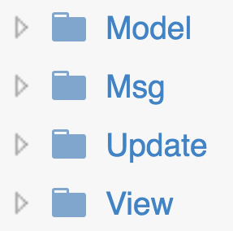
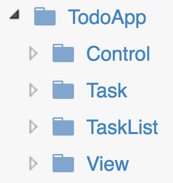

tl;dr: Check out the structured versions of TodoMVC [here](https://github.com/rogeriochaves/structured-elm-todomvc#structured-todomvc-in-elm).

**may/2016: Upgrade to Elm 0.17\
jun/2017: Upgrade to Elm 0.18**

Christian Alfoni wrote a [great article](http://www.christianalfoni.com/articles/2015_11_30_Exploring-Elm-part1) about how to structure your Elm app, inspired by that, I decided to refactor the [official TodoMVC example](https://github.com/evancz/elm-todomvc) by Evan, which has only one file, to split the logic.

To explain why this is necessary, I'll quote Christian:

> All examples of Elm applications I have seen is expressed as one single file. That does not work in bigger applications. How does splitting my app in different files affect how Elm works?

The community needs more bigger app examples, and I'll try to help with that using the famous TodoMVC example.

The refactor experience
-----------------------

Before starting, I  really need to point out how awesome experience was completely refactoring an Elm app: a joyful, painless experience!

I moved things, I renamed things, I changed the whole app, and on each step the result was always the same: after compiling, the app was still working flawlessly.

It was the most safe refactoring I've ever done, thanks to Elm and its powerful compiler.

Splitting the Model
-------------------

Thanks to [The Elm Architecture](https://github.com/evancz/elm-architecture-tutorial), it's not very hard to look at our code and see how it should be split, let's just look to the original Model:

```elm
type alias Model =
    { tasks : List Task
    , field : String
    , uid : Int
    , visibility : String
    }

type alias Task =
    { description : String
    , completed : Bool
    , editing : Bool
    , id : Int
    }
```

It's easy to notice that we can move the Task type to another file, but look closer, and you will notice that there are actually 4 things being handled by this model: the new task being created (using field and uid), the list of current tasks, each task inside that list, and the visibility control.

It's 4 things, and just by looking at the model it doesn't seem very messy, but when we get to the update function, things gets confusing:

```elm
update : Msg -> Model -> ( Model, Cmd Msg )
update msg model =
  case msg of
    NoOp ->
      model ! []

    Add ->
      { model
        | uid = model.uid + 1
        , field = ""
        , tasks =
            if String.isEmpty model.field then
              model.tasks
            else
              model.tasks ++ [newTask model.field model.uid]
      }
        ! []

    UpdateField str ->
      { model | field = str }
        ! []

    EditingTask id isEditing ->
      let
        updateTask t =
          if t.id == id then { t | editing = isEditing } else t
      in
        { model | tasks = List.map updateTask model.tasks }
          ! [ focus ("#todo-" ++ toString id) ]

    UpdateTask id task ->
      let
        updateTask t =
          if t.id == id then { t | description = task } else t
      in
        { model | tasks = List.map updateTask model.tasks }
          ! []

    Delete id ->
      { model | tasks = List.filter (\t -> t.id /= id) model.tasks }
        ! []

    DeleteComplete ->
      { model | tasks = List.filter (not << .completed) model.tasks }
        ! []

    Check id isCompleted ->
      let
        updateTask t =
          if t.id == id then { t | completed = isCompleted } else t
      in
        { model | tasks = List.map updateTask model.tasks }
          ! []

    CheckAll isCompleted ->
      let
        updateTask t =
          { t | completed = isCompleted }
      in
        { model | tasks = List.map updateTask model.tasks }
          ! []

    ChangeVisibility visibility ->
      { model | visibility = visibility }
        ! []
```

This update function does too much. It handles changes on the task list (add, delete), new task entries (update field, add), visibility changes and changes for each Task inside the list (noticed how we repeated "let updateTask t = if..." 3 times? Also, only EditingTask returns a Cmd, all the others end with ! [])

So, I propose that we break that in four things:

Task: we already have this broken\
TaskList: just a list of tasks, nothing else\
TaskEntry: something that will become a task\
Control: tasks visibility for the app

But wait a minute, what does this TaskEntry has? An id and a description? Hmm it looks like a task! So we can actually simplify our code by reusing the Task type, which will be appended to the TaskList later, then we can get rid of "field" and "uid".

So this is our final models:

```elm
type alias Task =
  { description : String
  , completed : Bool
  , editing : Bool
  , id : Int
  }

type alias TaskList =
  List Task

type alias Control =
  { visibility : String
  }

type alias Model =
  { taskEntry : Task
  , taskList : TaskList
  , control : Control
  }
```

This will help us to break our Msgs and Updates

Splitting the Msg
-----------------

Splitting the Model was very straightforward, likewise, we can break our Msg, from this:

```elm
type Msg
    = NoOp
    | UpdateField String
    | EditingTask Int Bool
    | UpdateTask Int String
    | Add
    | Delete Int
    | DeleteComplete
    | Check Int Bool
    | CheckAll Bool
    | ChangeVisibility String
```

To this:

```elm
type TaskMsg
    = Check Bool
    | Editing Bool
    | Update String

type TaskListMsg
    = Add Int String
    | Delete Int
    | DeleteComplete
    | CheckAll Bool

type ControlMsg
    = ChangeVisibility String

type Msg
    = NoOp
    | MsgForTaskEntry TaskMsg
    | MsgForTaskList TaskListMsg
    | MsgForTask Int TaskMsg
    | MsgForControl ControlMsg
```

So, there are a few things to explain here. Notice how we created a new type that holds the msg for each one of our 4 things.

This will allow us, in the view, to say to where in the model we want to send that msg to. At the same time, a single Msg can change multiple parts of our model, for example, when you Add a task, the TaskEntry is appended to the TaskList, but when this Msg happens, the TaskEntry should also erase itself, so the user can type a new task.

Note that the MsgForTask also receives an Int, that's because we need to tell what is the id of the task we are trying to send a Msg.

Splitting the Update
--------------------

The update is perhaps the part of the code that holds most logic, so I'll just show the TaskList update function, which is the bigger one. You can check out the other updates on the final app code [here](https://github.com/rogeriochaves/structured-elm-todomvc/tree/nomap-technical) and [here](https://github.com/rogeriochaves/structured-elm-todomvc/tree/nomap-domain).

```elm
update : Msg -> Model -> Model
update msgFor taskList =
    case msgFor of
        MsgForTaskList msg ->
            updateTaskList msg taskList

        MsgForTask id msg ->
            updateTask id msg taskList

        _ ->
            taskList


updateTaskList : TaskListMsg -> Model -> Model
updateTaskList msg taskList =
    case msg of
        Add id description ->
            if String.isEmpty description then
                taskList
            else
                taskList ++ [ newTask id description ]

        Delete id ->
            List.filter (\t -> t.id /= id) taskList

        DeleteComplete ->
            List.filter (not << .completed) taskList

        CheckAll isCompleted ->
            let
                updateTask t =
                    UpdateTask.updateTask (Check isCompleted) t
            in
                List.map updateTask taskList


updateTask : Int -> TaskMsg -> Model -> Model
updateTask id msg taskList =
    let
        updateTask task =
            if task.id == id then
                UpdateTask.updateTask msg task
            else
                task
    in
        List.map updateTask taskList
```

So, this update has actually two jobs: handling Msgs specifically for TaskList and directing the Msgs for each task based on its id. Notice how we call "UpdateTask.updateTask msg task", the logic for changing the insides of a Task is no longer here, it's inside the UpdateTask module.

In the update function, the function decides wether it should act on the list, or on a specific item, based on the MsgFor type. It doesn't care about the other Msgs (MsgForControl for example), so it just returns the TaskList as is for them.

This allow us to compose our Update functions like this:

```elm
update : Msg -> Model -> Model
update msg model =
    { model
        | taskEntry = Task.update msg model.taskEntry
        , taskList = TaskList.update msg model.taskList
        , control = Control.update msg model.control
    }
```

So, when any Msg comes, we pass it through all of our Update functions, to reach our final model.

I showed how can we split the TodoMVC (I won't show how to split the Views because there is almost no changes there, only separating files really), but how do we organize our folders structure?

I achieved two solutions:

1 --- Structure with Technical focus
----------------------------------

The idea here is having the logic for your modules organizing according to their what they technically are, so basically this:



In each one of those folders have a **Task.elm**, **TaskList.elm** and a **Control.elm**.

Also, in each one we have a file called **Main.elm**, which combines the other files, e.g. the **Update/Main.elm** is a combination of all other Updates in the project, the **Model/Main.elm** is a combination of all other models in the project, and so on.

Then, in our root main function, we just need to use them.

Checkout the code for this structure [here](https://github.com/rogeriochaves/structured-elm-todomvc).

2 --- Structure with Domain focus
-------------------------------

This idea is basically a transposed matrix of the first, instead on focusing on the technical aspect, we will focus on our domain:



Inside each one of those folders (including **TodoApp**), we have a **Model.elm**, a **Msg.elm**, an **Update.elm**, and a **Views** folder. The **TodoApp/Model.elm** is a combination of all other models, the **TodoApp/Update.elm** combines the other updates, and so on.

One argument in favor of this approach is that you can look to the code and discover right away what the app is about, instead of discovering what architecture it uses (we know it will always be The Elm Architecture anyway).

I've also seen this being called as **fractal** by André Staltz on his blogpost about [Unidirectional User Interface Architectures](http://staltz.com/unidirectional-user-interface-architectures.html).

> A unidirectional architecture is said to be fractal if subcomponents are structured in the same way as the whole is.

So each folder is like a little Elm app itself.

Checkout the code for this structure [here](https://github.com/rogeriochaves/structured-elm-todomvc/tree/modular).

Conclusion
----------

Even though the Elm language and The Elm Architecture are awesome, we still need to break our code so it can scale a be a full-grown app. Even great languages can produce messy code when in the wrong hands (or timeframe?).

Specially that now, more than ever, you can refactor ALL the things, one, two, a hundred times, without fear, because the compiler is there for you.

This was just my personal ideas on how to achieve that, and I'd love some feedbacks on how can I improve them.

How do you structure your Elm app?
