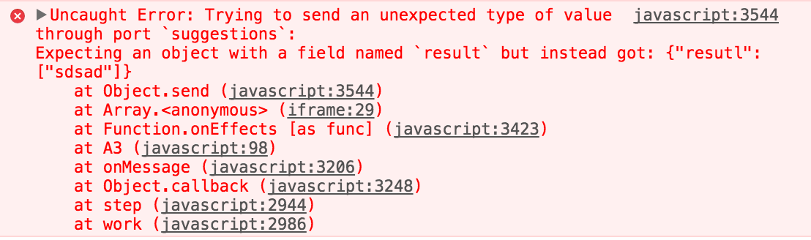

So, one thing that is often said is that Elm treats JavaScript as something external, just like HTTP requests. But that's not exactly true, there is a fundamental difference: **ports decode javascript automatically**.

So, suppose you have this port:

port suggestions : ({ result : List String } -> msg) -> Sub msg

And you call it like this:

app.ports.suggestions.send({ resutl: suggestions });

What? A runtime error! Oh my god!



Here is the full example:

<iframe src="https://ellie-app.com/embed/jKj5nssDp2a1" style="width:100%; height:400px; border:0; overflow:hidden;" sandbox="allow-modals allow-forms allow-popups allow-scripts allow-same-origin"></iframe>

Yeah, the app broke due to a typo, and you hadn't a chance to handle this exception, this is due to the automatic conversion ports tries to do.

This doesn't happen on HTTP where you are drive into writing a decoder. I believe Elm is like this because usually you have much more control of the JavaScript you are interoping with than the server and specially the network.

In other words, if you have an error like this it is easy to just fix your JS code, and probably you can catch it with tests on the JS side. But, it has occurred to me getting unexpected objects being sent to a port when I was using it to communicate Elm with a third-party library, which could be as dangerous as an HTTP request.

Decoders to the Rescue!
=======================

Did you know Elm accepts JSON encoded values through Ports? Yeah, we can use that for more safety.

From JS, call your port like you would normally do:

```javascript
app.ports.suggestions.send({ result: suggestions });
```

But then on the Elm side, instead of defining the types of the object, use `Json.Decode.Value` to decode it manually:

```elm
port suggestions : (Decode.Value -> msg) -> Sub msg


subscriptions : Model -> Sub Msg
subscriptions model =
    suggestions (decodeSuggestions >> Suggest)


decodeSuggestions : Decode.Value -> Result String (List String)
decodeSuggestions =
    Decode.decodeValue
        (Decode.field "result" (Decode.list Decode.string))
```

There! Now you have a chance to handle missing fields, unexpected formats, typos, in other words, lower chances of running into a runtime exception. Here is the full example:

<iframe src="https://ellie-app.com/embed/jKjf8wQMYya1" style="width:100%; height:400px; border:0; overflow:hidden;" sandbox="allow-modals allow-forms allow-popups allow-scripts allow-same-origin"></iframe>

Decode JSON without Decoders
============================

Now that we learned how to use JSON Decoders for Ports, what if we do the other way around? Use Ports for JSON Decoding!

**I do not recommend this**, but it is interesting that we can leverage on that automatic decoding made by Ports.

For testing that, I've modified the random cats gifs example, first, instead of `Http.get` i'm using `Http.getString`, because I don't want to parse the JSON response just yet.

```elm
getRandomGif : String -> Cmd Msg
getRandomGif topic =
    let
        url =
            "https://api.giphy.com/v1/gifs/random?api_key=dc6zaTOxFJmzC&tag=" ++ topic
    in
        Http.send ParseGif (Http.getString url)
```

Then on my update function I call a Port which will send the JSON to be decoded by JavaScript:

```elm
ParseGif (Ok json) ->
  ( model, parseJson { callback = "gifResponse", json = json } )
```

Here is how the Ports look like:

```elm
port parseJson : { callback : String, json : String } -> Cmd msg

port gifResponse : (GifResponse -> msg) -> Sub msg

type alias GifResponse =
    { data :
        { image_url : String
        }
    }
```

With this, basically I'm telling javascript which JSON I want to decode and which Port it should use as a callback. Here is the JavaScript code:

```javascript
const app = Elm.Main.fullscreen();

app.ports.parseJson.subscribe(({ callback, json }) => {
  app.ports[callback].send(JSON.parse(json));
});
```

That's it! We can basically reuse that to decode any JSON, and everything works! Check it out the full example:

<iframe src="https://ellie-app.com/embed/jKjQ2YLV3wa1" style="width:100%; height:400px; border:0; overflow:hidden;" sandbox="allow-modals allow-forms allow-popups allow-scripts allow-same-origin"></iframe>

Just a note, even though the JSON from giphy came with a lot of extra fields, that doesn't break our Port because Ports ignore extra, unexpected fields. For example:

```javascript
app.ports.suggestions.send({ result: suggestions, foo: 'bar' });
```

Sending the extra `foo` here won't break your app (full code: <https://ellie-app.com/GYHXpQGSSha1/1>).

Of course, this doesn't have a lot of features that decoders have like `oneOf`, and again, **I do not recommend this**, because it is dangerous, but it is yet another way of decoding JSON in Elm.

Cheers!