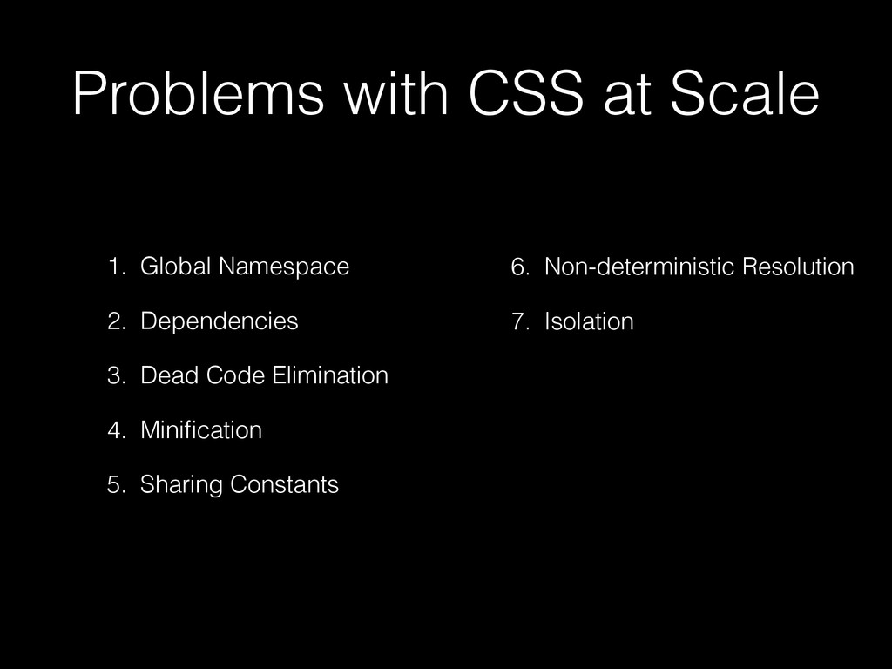
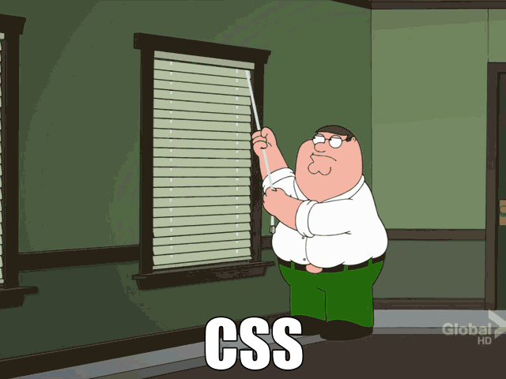

(this blogpost is based [on a PR](https://github.com/CaronaBoard/caronaboard/pull/45) I did where elm-css fit very well)

**update 17/12/2017: this blogpost refers to an outdated elm-css version, newer versions are even better as they avoid global namespaces completely. The code snippets here will not work anymore.**

Hello,

First of all, sorry for the sensationalist title, CSS is not really broken, it just have some problems. Also, Elm is not the only solution for them, in fact all ideas came from JavaScript community. But if you already know Elm, you are probably like me and want to write everything in it, including CSS.

So, I'm not always following the CSS news, but I feel like CSS evolves slower than JavaScript for example (where there are hundreds of new libraries everyday), but one major movement I saw was after React launched, and people started asking how to better style their components, this this talk came along: <https://vimeo.com/116209150>

This talk is great cause it points out problems with CSS that I haven't thought before, basically, those ones:



I never knew exactly why, but messing with CSS in a big project is indeed troublesome (to the point that I see senior engineers afraid of it), but after seeing this list above, things starting make sense, I never tried to look at CSS as a normal programming language so I never thought about those.

Notice that solving this still does not solve styling problems, which can be hard as well (thank God they invented flexbox), this is a different subject, I believe this list points out **code problems**, and elm-css helps us fixing them.

Since then, awesome tooling like [PostCSS](https://github.com/postcss/postcss) and [css-modules](https://github.com/css-modules/css-modules) came along to solve those problems, elm-css took inspiration from them (recently it even became possible to [load css-modules from within Elm](http://package.elm-lang.org/packages/cultureamp/elm-css-modules-loader/latest)).



everyday somebody sends this gif somewhere

But, we will focus exclusively on elm-css. If you want to install elm-css in your project, check out the [official repo](https://github.com/rtfeldman/elm-css), here I'll focus on how elm-css helps tackling those problems pointed out above.

1\. Global Namespace
====================

CSS classes are always global, polluting the global scope, allowing conflicts and forcing you to choose weird names.

Elm-css allows you to namespace your stylesheets by using `CssHelpers.withNamespace`, giving it back a `class` function that can be called with a list of classes from your styles that you can use it like this:

```elm
{ id, class, classList } =
    Html.CssHelpers.withNamespace "example"view =
    div []
        [ div [ class [ MyCss.Nav ] ] [ text "using Nav class" ]
        , div [ class [ MyCss.Page ] ] [ text "using Page class" ]
        ]
```

On the final css, this will produce classes named `.exampleNav` and `.examplePage`, which will not conflict with other Nav and Page classes that may exist.

Since we have namespaces, what I like to do is creating one stylesheet per module/page on my project (one stylesheet for Login, another Homepage, etc), and another for layout/shared stuff. As [@glauberramos](https://github.com/glauberramos) suggested: "Keep the styles near, so when you are changing a component you change everything in the same folder.".

If needed, we can easily split stylesheets even further with elm-css, since everything is just a function.

2\. Dependencies
================

Elm-css is just elm code, so direct dependencies are just `import`s:

```elm
import Common.Colors exposing (lightTextColor)

button : List Mixin
button =
    [ width (pct 100)
    , lightTextColor
    ]
```

I believe we should not have or at least avoid indirect dependencies, in other words, expecting that a class will be globally available for us to use and modify, I explain more about that on Non-Deterministic Resolution.

In the project I implemented elm-css, the only indirect dependency that we still had was from materialize.css, that leaves its classes globally available.

For that, to be very explicit, I've created a helper function called `materializeClass`, we can use it like this:

```elm
import Common.CssHelpers exposing (materializeClass)

view model =
  button [ materializeClass "btn-large" ] []
```

It basically accepts any string, but the name makes it extra clear that should only be used to access materialize classes, and they will be the only globally available ones. Also, we should avoid as much as possible to modify materialize classes in our stylesheets, instead, we add a new class that adds a new style and our component implement both.

So, like [@jcmidia](https://github.com/jcmidia) suggested, we can consider materialize as our "reset.css", and eventually we will have customized all of our styles, at this point we can get rid of materialize.

3\. Dead Code Elimination
=========================

I'm counting on elm-css compiler, elm compiler, webpack and uglify for this one. Since it is all javascript code at the end, maybe they can do some clever detections of functions and rules duplicated or not being used.

I haven't actually compared the final bundle size of both approaches (scss vs elm-css) on the project I implemented it, but given the small size of the project, the difference is probably irrelevant.

Sorry for not having more on that, if you have any materials, please share.

4\. Minification
================

Webpack + Uglify takes care of it ;)

5\. Sharing Constants
=====================

Again, it is just code, we can simply share functions. So far I only felt the need of having a file for the colors, I'll talk more about that later.

6\. Non-Deterministic Resolution
================================

This is an important part in my opinion, this is about understanding what styles will actually be applied.

For example, if you have a `<button class="btn-green btn-blue" />` what color will the button actually be? Blue or Green? Does the order here or in the stylesheet matter?

And this is not just this simple problem, there are a lot of shaneningans on how css will prioritize the rules, which lead a lot of people into using `!important` (but what if both btn-blue and btn-green had !important?)

For solving that, I've wrapped the `class` helper function from elm-css to make it accept only one argument, one class, rather than a list of classes, so, you cannot do that:

```elm
div [ class [ Button ButtonGreen ] ] []
```

You can only do this:

```elm
div [ class ButtonGreen ] []
```

But then you may ask, "how will we inherit styles from Button as well?", the answer is simple: extract the common styles to a function!

Instead of this:

```elm
styles =
  (stylesheet << Css.Namespace.namespace namespace)
    [ cssClass Button
      [ width (pct 100)
      , darkTextColor
      , backgroundColor white
      ]
    , cssClass ButtonGreen
      [ backgroundColor green
      ]
    , cssClass ButtonBlue
      [ backgroundColor blue
      ]
    ]
```

we do this:

```elm
styles =
  (stylesheet << Css.Namespace.namespace namespace)
    [ cssClass ButtonGreen <|
        button ++
          [ backgroundColor green
          ]
    , cssClass ButtonBlue
        button ++
          [ backgroundColor blue
          ]
    ]

button : List Mixin
button =
    [ width (pct 100)
    , darkTextColor
    , backgroundColor white
    ]
```

See? We composed our styles on the stylesheet rather then on the html, and it is very clear and deterministic which rules will apply and which will be overwritten.

This is similar with what `composes` in [PostCSS](http://postcss.org/) does, the difference is that we duplicate generated CSS code styles, but given gzip, [this is actually a more performatic approach](https://csswizardry.com/2016/02/mixins-better-for-performance/).

7\. Isolation
=============

Thanks to the type system, with elm-css we cannot mix classes from one stylesheet into another, so we do have isolation. Of course it may break the isolation if we add some generic `div {}` or `* {}`rules, which are not a good idea, we should use typed classes (not ids because they can't be repeated on the same page).

The downside is that we need different `class` functions for using classes from different scoped stylesheets in the same view, for example:

```elm
import Layout.Styles as Layout exposing (Classes(Navbar))
import Login.Styles as Login exposing (Classes(Button))view model =
  nav [ Layout.class Navbar ]
    [ button [ Login.class Button ] []
    ]
```

Wrapping Up
===========

Being able to write CSS with the help of the Elm compiler is an awesome experience, and as I've shown, we can solve those CSS problems mostly because we are now using a (cool) programming language to write it, gaining a lot of benefits for free.

Still, it is not perfect, as I've said, CSS styling is hard, but there are also initiatives for this in the lines of: what if we removed the bad stuff from CSS, and only allowed to use the good parts? Given flexbox, do we need float to be available? This is basically what Elm itself does with web development.

Elm-css is more generalist, if you are interested in some more restricted like this, check out [style-elements](http://package.elm-lang.org/packages/mdgriffith/style-elements).

Cheers!

## Comments


If you'd like to add a comment, please [send a merge request adding your comment here](https://github.com/rogeriochaves/blog/edit/master/source/_posts/%%filename%%), copying this block as an example
