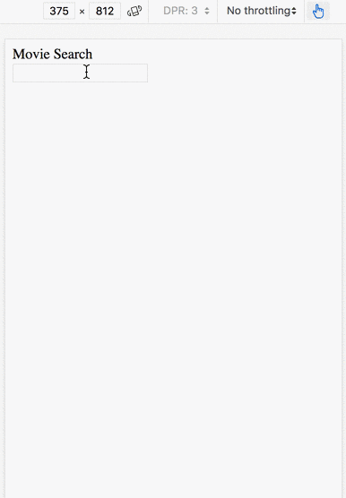
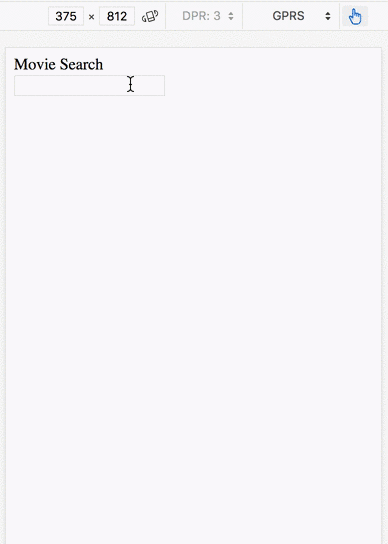
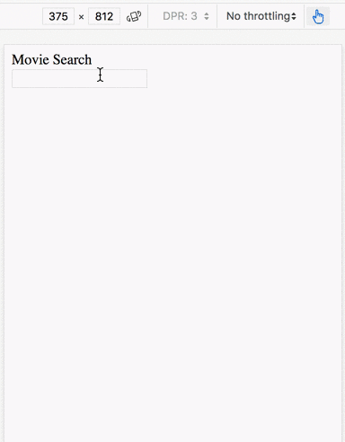
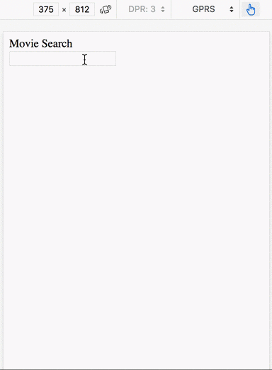

I've made a proof-of-concept project trying to replicate some of the react suspense features in [this repository](https://github.com/rogeriochaves/elm-suspense). This project is a recreation of [this react suspense demo](https://codesandbox.io/s/5zk7x551vk).

What's good about suspense? Some features caught my attention:

Data load co-located with the view
==================================

Usually in Elm the data fetching is at the router or some other place far from the view, having them together can make it easier to follow where the data is going and also move a view around in a more "plug-and-play" manner

Suspend and timeout for loading pattern in fast connections
===========================================================

For slow internet speeds we usually show a "Loading" message for the users, which is great and [elm notably helps us a lot about not forgetting that](http://blog.jenkster.com/2016/06/how-elm-slays-a-ui-antipattern.html). But, for fast internet connections, a "Loading" flicking really quick all the time can be very annoying.

We do not have to decide between one case or the other though, we can make the experience great for **both** at once, and suspend helps with that through the timeout component, which shows a "Loading" message, but only after some miliseconds.

Preloading of images
====================

On the web it's common to render the html as soon as we get it, and different pieces like images load one after another, top to bottom, causing a lot of layout changes until everything's in place.

But we can have a better experience than that, with suspense, we can wait util everything is fully ready before rendering the screen for the user

Demos
=====

Fast internet connection without Suspense features
--------------------------------------------------

Notice how everything flicks constantly, blinks of "Loading..." with very fast layout changes all the time



Slow internet connection without Suspense features
--------------------------------------------------

With a slow internet the "Loading..." is ok, but the images load little by little, causing a little bit of agony



Fast internet connection with Suspense features
-----------------------------------------------

Everything looks instant now, no more screen flickings or layout change



Slow internet connection with Suspense features
-----------------------------------------------

The user now knows it's loading, but does not receive a broken experience anymore, we wait until everything is ready to show



How it works
============

Loading data
------------

In order for all this to work, I had to subvert the elm-architecture a little bit to be able to return Cmds while rendering, which means that you can load data, but that's nicely wrapper around the idea of caches to your date. If you have a view that needs to load some data, you can do it like this:

```elm
myView : Model -> String -> CmdHtml Msg
myView model id =
    getFromCache model.suspenseModel
        { cache = model.myCache
        , key = id
        , load = someHttpRequest id -- this is the actual request
        }
        (data ->
            div []
              [ ...render it here...
              ]
        )
```

Adding a timeout
----------------

On the example above, the view won't render until the data is ready, but sometimes you want to render at least something to give feedback to the user, you can do that using the `timeout` function, in which you can specify a fallback and a time for it to show. You can also replace this with the `suspense` function if you don't want to have any fallbacks.

The interesting part is that this function can be many parents above with many levels of suspended or regular views inside it, it's not directly bound to the data loading.

```elm
waitForMyView : Model -> String -> CmdHtml Msg
waitForMyView model id =
    (timeout model.suspenseModel
        { ms = 500, fallback = text "Loading...", key = "myViewTimeout" }
        (myView model id)
    )
```

Preloading images
-----------------

You can use the function `preloadImg` to render a view only after a image is loaded, it's as simple as this:

```elm
myViewWithImg : Model -> CmdHtml Msg
myViewWithImg model =
    preloadImg model.suspenseModel
        { src = "myimg.png" }
        (div [ ]
            [ img [ src "myimg.png" ] []
            , text "the image is ready!"
            ]
        )
```

Other details
-------------

There are also other helper functions like `mapCmdView` and `mapCmdViewList` to help you wrapping the html inside the suspense features, and you also need to add some boilerplate on your main `Msg`, `Model` and `Update` for all this architectural change to work. Check the `src/` folder for more examples.

Conclusion
==========

Having suspense features can really help achieving a great user experience. Implementing that in Elm was much harder than just using it in React, but it is definitively possible and the final API became kinda easy to use.

What do you think? Should I turn elm-suspense into a library? Suggestions are welcome!

More details in the repository:

<https://github.com/rogeriochaves/elm-suspense>