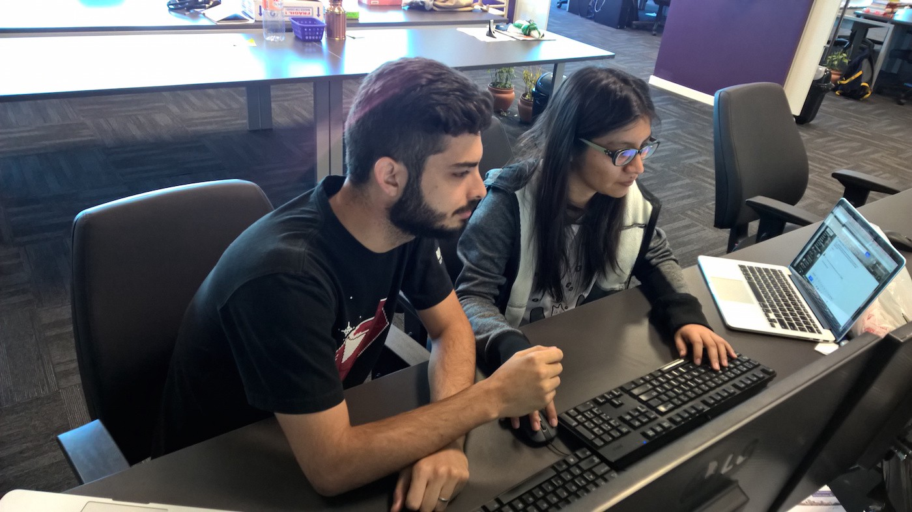
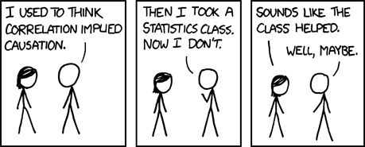
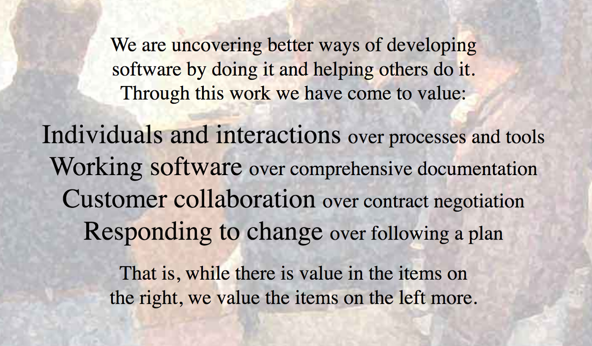

When I entered this world of Software Development I was overwhelmed by the amount of good practices, recommendations, processes, organizations, rules and everything else I had to learn to deliver good software.

It was overwhelming because I never learned any of those at college, nor when I worked in an advertising agency, but since I started developing long-lasting systems I realized how necessary those good practices are.

Now, I've never seen a company who have it all, usually there is more focus in one side then in the other, previously I was working at ThoughtWorks, where technical excellence was everything, now I am at Booking.com, where everybody is absolutely data driven. Ideally --- and I really think it's possible --- we should have it all.

So here is a good practices list:

Code
====

-   Write [Clean Code](https://www.amazon.com/Clean-Code-Handbook-Software-Craftsmanship/dp/0132350882): code should be so easy to follow that it becomes "self-documenting code". It is the most basic good practice in my opinion, it helps the other good code practices to build up, get every dev in your team to read the book
-   [TDD](https://www.amazon.com/Test-Driven-Development-Kent-Beck/dp/0321146530): it's not only about ensuring correctness, your code will become more organized and it will be faster to develop new features (yes, even if there are no existing tests on the codebase)
-   [Test Pyramid](https://martinfowler.com/bliki/TestPyramid.html): unit tests are not enough, but having too much end-to-end is also a terrible idea. Also, if you are doing microservices, there is [a whole lot more you need to cover](https://martinfowler.com/articles/microservice-testing/)
-   Pair Programming: this is the best way I know of developing software, you onboard people faster, you reduce [bus factor](https://medium.com/tech-tajawal/the-bus-factor-6ea1a3ede6bd) and bugs, improve code quality, devs have more focus, and, like TDD, it's counter-intuitive that you can actually delivery software faster by pairing
-   [Organize your Tech Debt](https://medium.com/@AikoPath/visualising-and-prioritizing-technical-debt-afc82e542681)
-   Security is non-negotiable

    Pair Programming

Data Driven
===========

-   A/B Test: formulate hypothesis and test them, forget your beliefs and let the data speak for itself, but only if you have enough statistical power
-   Use data to make decisions: what to develop next, what to prioritize
-   [Don't be data-driven, be data-informed](https://twitter.com/kimgoodwin/status/1051849805280948224): metrics should never be in charge because they have no moral compass
-   Check for Bias at all time: both [statistical](https://en.wikipedia.org/wiki/Bias_(statistics)) and [cognitive](https://en.wikipedia.org/wiki/List_of_cognitive_biases). You are not really data-driven if you are interpreting data wrong
-   [Datensparsamkeit](https://martinfowler.com/bliki/Datensparsamkeit.html): you don't need to store *everything* to do [big-data](https://bigdatapix.tumblr.com/), be privacy-first
-   Qualitative is as valuable as Quantitative: some things are very subjective and hard to measure and that's ok, talking to people is still the best way to empathize and solve your customer problems, and maybe discover new things to measure

    Correlation don't imply causation <a href="https://xkcd.com/552/">xkcd comic</a>

Delivery
========

-   [Continuous Integration](https://martinfowler.com/articles/continuousIntegration.html): merge your code into master frequently with an automated build pipeline
-   [Continuous Delivery](https://www.amazon.com/Continuous-Delivery-Deployment-Automation-Addison-Wesley/dp/0321601912): put code in production every day
-   [Feature Flags](https://www.martinfowler.com/articles/feature-toggles.html): allow you to deploy things that are not ready yet. Releasing a feature to your users should be a business decision, not a technical one
-   [Trunk Based Development or Short-Lived Branches](https://medium.com/@_rchaves_/pull-requests-or-trunk-based-development-86e66a8302f8): don't create parallel flows of work, again, merge often
-   [Code Reviews](https://mtlynch.io/human-code-reviews-1/): asynchronous knowledge sharing, improve code quality, but be nice and automate everything that a machine could have done (linters et al)
-   Don't rollout on a Friday afternoon

Monitoring
==========

-   Log as much as you can
-   Dashboards: easy to understand, not too much information, separate overview dashboards from those used for debugging, learn the right types of charts and descriptive statistics to use
-   [Alerts](https://docs.google.com/document/d/199PqyG3UsyXlwieHaqbGiWVa8eMWi8zzAn0YfcApr8Q/edit#!): alert on symptoms, not causes
-   Revert now, investigate later

Lean
====

-   [Deliver customer value, not product features](https://www.goodproductmanager.com/2008/05/20/deliver-customer-value-not-product-features/)
-   Limit the Work in Progress
-   User Stories should be as small as possible, but...
-   User Stories should always deliver customer value: [split your stories vertically](https://gojko.net/2012/01/23/splitting-user-stories-the-hamburger-method/), deliver one minimum valuable improvement at a time

Agile
=====

-   [Agile Manifesto](http://agilemanifesto.org/): memorize it, it comes in very handy
-   Change your plans: if data says so, if your costumers are asking to, if the market changes, you have to react, happy customers never complain that you took a different path if the final result was better
-   Collaborate all the time: surfacing all the problems and discoveries as soon as possible is what allow you to change directions with everybody onboard, that's why standups are so important
-   Do Retrospectives: it allows you to learn and improve everything, including the agile process itself
-   [Products over Projects](https://martinfowler.com/articles/products-over-projects.html)

    The Agile Manifesto

Teams
=====

-   Horizontal Company, Vertical Teams: break the silos, like the [DevOps movement](https://www.martinfowler.com/bliki/DevOpsCulture.html)
-   [Two-Pizza Teams](http://blog.idonethis.com/two-pizza-team/)
-   Have an Onboarding Plan: ramp up people faster, ask every newcomer to improve this plan with their struggles, rotate people between teams to reduce bus factor
-   [Co-located when possible, Remote First otherwise](https://www.martinfowler.com/articles/remote-or-co-located.html): even with all the modern tooling, my experience co-located has been better, but if anyone is remote, even a single person, then the team should do everything concerning remote, otherwise the collaboration will be terrible
-   T-Shaped people, or even [Paint Drip People](https://www.facebook.com/notes/kent-beck/paint-drip-people/1226700000696195)

Communication
=============

-   Have a Feedback Culture: [care personally and](https://www.radicalcandor.com/) [challenge directly](https://www.radicalcandor.com/)
-   Work on your communication skills: call people for a coffee, don't be afraid of asking for help, learn how to have [crucial conversations](https://www.amazon.com/Crucial-Conversations-Talking-Stakes-Second/dp/1469266822)
-   Overcommunicate
-   Team Building: build trust with your peers, go for team outings, laugh together
-   Manage expectations

Motivation
==========

-   Give people [Autonomy, Mastery and Purpose](https://www.youtube.com/watch?v=u6XAPnuFjJc)
-   Clear Ownership, shared Responsibility, and no finger-pointing
-   Have Hackdays and Hackathons
-   Be on the [Flow](https://alifeofproductivity.com/how-to-experience-flow-magical-chart/): balance boredom and anxiety

Diversity
=========

-   Diversity allow us to be more creative, less biased, more empathetic and to build a better environment that everyone likes be in
-   Meritocracy is a lie: it is very hard to do completely fair Performance Reviews, but we should try our best, minding our privileges and biases
-   Fire toxic people

Each of those topics above goes much deeper, and you will encounter different interpretations and implementations. In my experience, some of them were very easy to implement, you can do it locally, in your team, while others require a whole cultural change in the company.

I've been in teams which we tried new practices almost weekly, and in others where we struggled for months to change a single process inside the company, some successes, some failures, but in all the cases it was always worth trying and keep improving.

That was it, please suggest anything you think is as important as those and was not mentioned.

## Comments


If you'd like to add a comment, please [send a merge request adding your comment here](https://github.com/rogeriochaves/blog/edit/master/source/_posts/%%filename%%), copying this block as an example
