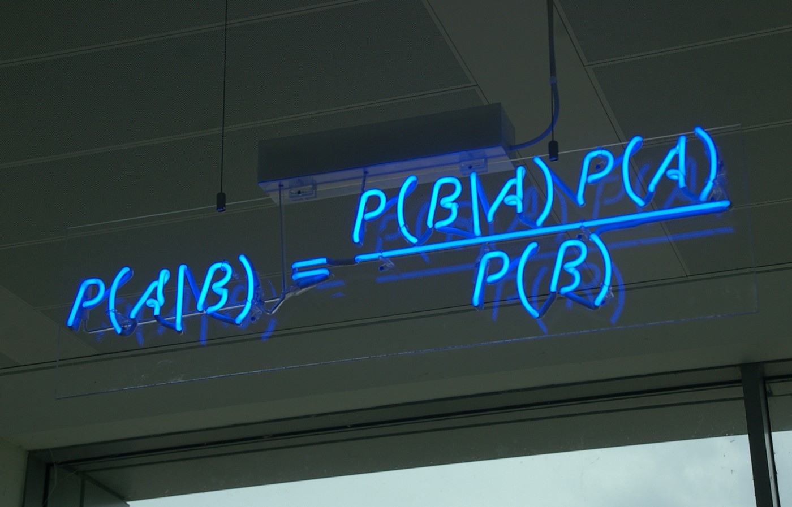
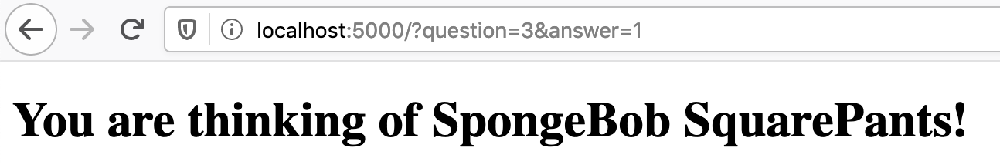

Recently I started studying about probabilistic programming, where the foundation to everything is Bayes Theorem. People always tell you that you need to have a "Bayesian Thinking" mindset to grasp probabilistic programming, and a part of this is learning to update your beliefs given new evidence.

That reminded me about this game [Akinator](https://akinator.com), where you think about a character, any character ever, and it will ask you questions to precisely figure out what you are thinking of. When Akinator came up the internet was still young, at the time it felt like magic! Now I realize it fits perfectly with Bayes: it has some beliefs of what character you may be thinking of, then it keeps asking you questions to gather more evidence of which character it may be.

In this tutorial, we will implement a simple version of Akinator using Python.

Let's start with a simple flask web server and a basic HTML for asking our questions:

```python
from flask import Flask, render_template, request
# we will need those imports later
import random
import numpy as np

app = Flask(__name__)


@app.route('/')
def index():
    return render_template('index.html', question=1, question_text="Hello world?")


if __name__ == '__main__':
    app.run()
```
```html
<!DOCTYPE html>
<html lang="en">
  <head>
  <meta charset="utf-8" />
  <title>Bayer Akinator</title>
</head>
<body id="home">
  
    <h1>You are thinking of {{ result }}!</h1>
  
    <h1>{{ question_text }}</h1>
    <form>
      <input type="hidden" name="question" value="{{ question }}" />
      <label><input type="radio" name="answer" value="1" required /> Yes</label><br />
      <label><input type="radio" name="answer" value="0" required /> No</label><br />
      <label><input type="radio" name="answer" value="0.5" required /> Don't know</label><br />
      <label><input type="radio" name="answer" value="0.75" required /> Probably</label><br />
      <label><input type="radio" name="answer" value="0.25" required /> Probably Not</label><br />
      <br />
      <input type="submit" value="Next" />
    </form>
  
</body>
</html>
```

Now if you start the web server with `python server.py` you will see this:


So how will this work? First let’s remember some theory, imagine I’m thinking of the pope, what is the chance the the pope is argentinian?

$$
P(argentinian | pope)
$$

This is what this notation means: what's the *probability* (denoted by P) that I get an argentinian *given that* (denoted by the |) I have the pope? Well 100%, because there is only one pope and he is argentinian. This is called the *forward probability*.

But what we are more interest into is in the reverse question:

$$
P(pope | argentinian)
$$

What's the probability of someone being the pope given that I know they are argentinian? You can see how that's completely different question and way harder, well in this case it is 1 in 45 million, because that's the population of Argentina and only one pope came out from it. This is called the *inverse probability*, and it's exactly what we want Akinator to do.

In the 18th century Reverend Thomas Bayes gave us a way to calculate the inverse probability. If you didn’t knew about it yet you can check the story behind it later, for now just trust the math. This is the formula, in cool neon:



In our case A is a **character** Akinator is trying to guess and B is the **answer** you gave to his question. So in english that would be: the probability that you are thinking about this **character** given that **answer** (*inverse probability*) is equals to the probability that you would give this **answer** given that you were thinking in that **character** (*likelihood*), times the independent probability of choosing that **character** (*prior*), divided by the independent probability of choosing that **answer** (*evidence*).

The only thing is that for our problem we have to extend this formula a bit, because Akinator has not only one evidence to consider, but several, acquired by asking questions to the player.

For example, if I'm thinking of Homer Simpson, and I already told you that my character is yellow and male:

$$
P(homer | yellow /\ male) = \frac{P(yellow | homer) P(male | homer) P(homer)}{P(yellow | homer) P(male | homer) P(homer) + P(yellow | \neg homer) P(male | \neg homer) P(\neg homer)}
$$

For more details on why the formula expands that way with multiple evidences, I recommend you check out this paper, which explains it really well: <http://cs.wellesley.edu/~anderson/writing/naive-bayes.pdf>

That's it, that's absolutely all the theory we need, let's get to the code!

First, to make things simpler, I won't use a database, just those data structures:

```python
questions = {
    1: 'Is your character yellow?',
    2: 'Is your character bald?',
    3: 'Is your character a man?',
    4: 'Is your character short?',
}

characters = [
    {'name': 'Homer Simpson',         'answers': {1: 1, 2: 1, 3: 1, 4: 0}},
    {'name': 'SpongeBob SquarePants', 'answers': {1: 1, 2: 1, 3: 1, 4: 0.75}},
    {'name': 'Sandy Cheeks',          'answers': {1: 0, 2: 0, 3: 0}},
]
```

I added 4 questions and 3 characters: Homer Simpson, SpongeBob, which is really similar to Homer except on the last question, and Sandy Cheeks, which is exactly the opposite of SpongeBob. The idea of choosing those is to test how our Akinator behaves both with obvious differences and with very tiny ones.

Each key on the question's dict will be its id, then on the characters list we have a map of answers to those questions. Notice that Sandy has a missing answer, that's fine as Akinator won't have answers for all characters all the time, specially for new ones.

Now let's replace our `index` function to add the main logic of our game:

```python
questions_so_far = []
answers_so_far = []


@app.route('/')
def index():
    global questions_so_far, answers_so_far

    question = request.args.get('question')
    answer = request.args.get('answer')
    if question and answer:
        questions_so_far.append(int(question))
        answers_so_far.append(float(answer))

    probabilities = calculate_probabilites(questions_so_far, answers_so_far)
    print("probabilities", probabilities)

    questions_left = list(set(questions.keys()) - set(questions_so_far))
    if len(questions_left) == 0:
        result = sorted(
            probabilities, key=lambda p: p['probability'], reverse=True)[0]
        return render_template('index.html', result=result['name'])
    else:
        next_question = random.choice(questions_left)
        return render_template('index.html', question=next_question, question_text=questions[next_question])
```

Hopefully the code should be straightforward to follow. We create two variables to save the state of the game so far in memory: `questions_so_far` and `answers_so_far`, then we check if the user submitted the HTML form and add their question and answer to those variables. The `question` param is the question id the user is answersing, and the `answer` param is a float between 0 and 1 representing the confidence the user has that the answer was yes.

Next we use the current state of the game to calculate the probabilities for all characters, this is our Bayes calculation that we'll see next (I also added a `print` statement to follow what's changing after each answer). Then we check if there are any questions left, if so we choose a random next question to ask the user, if not we get the character with the biggest probability and finish the game, surprising the player "how could Akinator read my mind?"

Our `calculate_probabilities` function is basically just a loop that calculates the probability for each character:

```python
def calculate_probabilites(questions_so_far, answers_so_far):
    probabilities = []
    for character in characters:
        probabilities.append({
            'name': character['name'],
            'probability': calculate_character_probability(character, questions_so_far, answers_so_far)
        })

    return probabilities
```

The `calculate_character_probability` functions is where the brain of Akinator really lives:

```python
def calculate_character_probability(character, questions_so_far, answers_so_far):
    # Prior
    P_character = 1 / len(characters)

    # Likelihood
    P_answers_given_character = 1
    P_answers_given_not_character = 1
    for question, answer in zip(questions_so_far, answers_so_far):
        P_answers_given_character *= max(
            1 - abs(answer - character_answer(character, question)), 0.01)

        P_answer_not_character = np.mean([1 - abs(answer - character_answer(not_character, question))
                                          for not_character in characters
                                          if not_character['name'] != character['name']])
        P_answers_given_not_character *= max(P_answer_not_character, 0.01)

    # Evidence
    P_answers = P_character * P_answers_given_character + \
        (1 - P_character) * P_answers_given_not_character

    # Bayes Theorem
    P_character_given_answers = (
        P_answers_given_character * P_character) / P_answers

    return P_character_given_answers


def character_answer(character, question):
    if question in character['answers']:
        return character['answers'][question]
    return 0.5
```

For the prior `P_character` we simply use 1 divided by the number of characters. That is, without knowing absolutely anything or asking you any questions, the probability you thinking about SpongeBob is 33%.

Then calculating `P_answers_given_character` and `P_answers_given_not_character` is more complicated. If you peek back at the formula above, you'll see that we need to multiply each *P(answer|character)*, so we start with 1 and loop over each pair of question and answer.

Suppose I answered 1 to the question "Is your character yellow?" and I'm checking the probability for Homer, so *P(yellow = 1|homer)*. To calculate that we use the helper function `character_answer` to see what's the probability of homer being yellow, which is 1, if we had no information about it we would use 0.5, as the default answer for everybody.

Now, if the player also answered 1 to this question, it's a match, we return 1 for *P(yellow = 1|homer)*, had the user answered 0, then we need to return 0 for *P(yellow = 0|homer)*. That's what the little formula *1 - abs(answer - character_answer)* does for us. Finally, we use `max` to avoid having 0 in our multiplication because 0 could nullify all the probabilities and not give a chance for the character to have a probability to be chosen even if the user selects a single wrong answer.

Next for `P_answer_not_character` we do basically the same, but for all other characters, and take an average.

Finally can just multiply the variables we already have to get the `P_answers` and `P_character_given_answers` according to the formula.

If we [calculated everything correctly](https://www.xkcd.com/2059/) our game should be working, and Akinator will correctly predict I was thinking of SpongeBob



That's it, we could implement Akinator in less then 100 lines of code!

What's next?
============

You may have noticed there are still some things missing from the game, I recommend you to try implementing those as an exercise:

-   Early stop asking questions if Akinator is really sure of the answer
-   Allow users to add new characters if Akinator got it wrong, and save their answers
-   Reinforce characters answers if Akinator got it right
-   Allow users to add new questions
-   Use a database instead of in-memory to be able to add new characters and questions indefinitely
-   Instead of randomly choosing questions, select the ones that could untie the top guesses

Also, if you are interested in Bayesian Statistics and Probabilistic Programming here is some interesting content:

-   Blogpost: [Probability concepts explained: Bayesian inference for parameter estimation.](https://towardsdatascience.com/probability-concepts-explained-bayesian-inference-for-parameter-estimation-90e8930e5348)
-   Book: [Bayesian Analysis with Python and PyMC3](https://www.amazon.com/dp/B07HHBCR9G)
-   Podcast: [Learning Bayesian Statistics](https://learnbayesstats.anvil.app/)

Thank you for reading

## Comments


If you'd like to add a comment, please [send a merge request adding your comment here](https://github.com/rogeriochaves/blog/edit/master/source/_posts/%%filename%%), copying this block as an example
