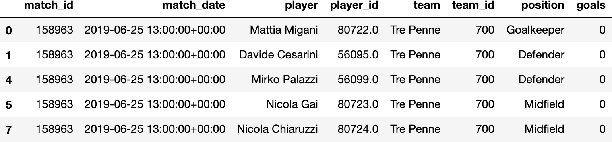
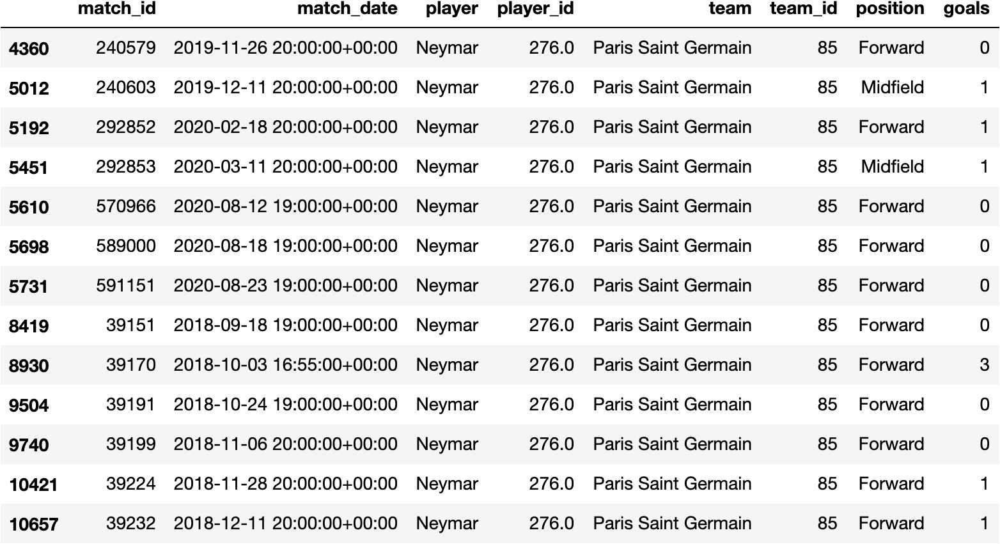
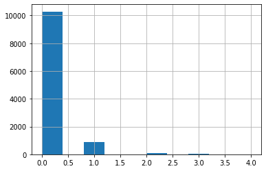
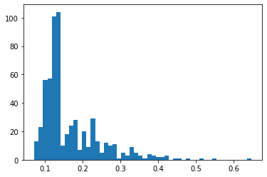
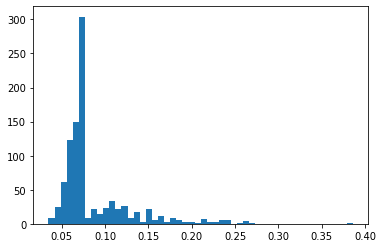
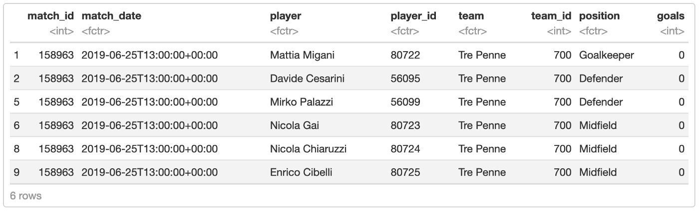
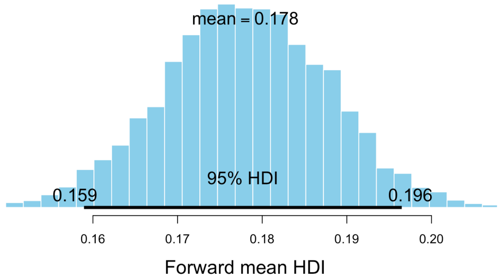
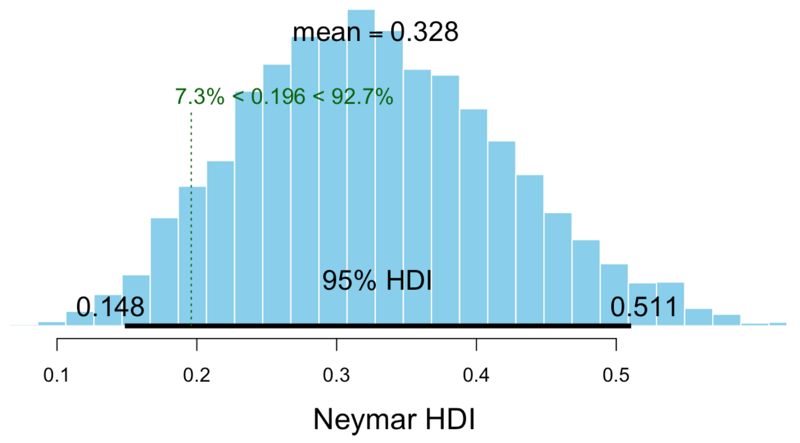
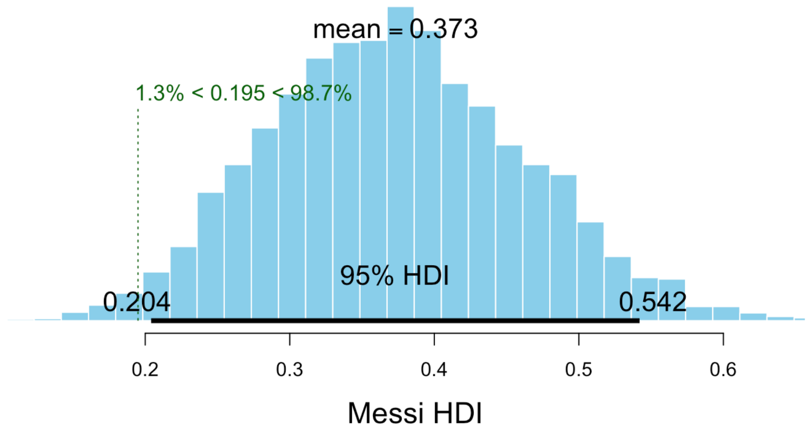

I've been reading the book [Doing Bayesian Data Analysis](https://www.amazon.com/Doing-Bayesian-Data-Analysis-Tutorial/dp/0124058884), and there is an example there with baseball, which I'd like to try for football.

Basically, we want to estimate what's the probability of a player scoring in a match, and which part of that probability is influenced by their position on the field vs other factors. We'll focus on Neymar but I'm actually using the data of all players from UEFA Champions League.

First let's load our data. I collected data from UEFA Champions League for 2018 and 2019--2020, each row is a participation of a player in a match, with which position they were on this match, and how much goals they scored. Players that were in substitution bench during the match but never entered the field are not included

```python
import pandas as pd
import numpy as np

df = pd.read_csv("uefa_player_matches.csv", parse_dates=["match_date"])
df = df.dropna()
df = df[df['position'].isin(["G", "D", "M", "F"])] # excluded "SUB" and "-" positions
position_map = {'G': 'Goalkeeper', 'D': 'Defender', 'M': 'Midfield', 'F': 'Forward'}
df['position'] = [ position_map[x] for x in df['position'] ]
df.head()
```



Let's take a look on matches that Neymar participated

```python
df[df['player'] == 'Neymar']
```



Just to help us understand our data a bit, what's the distribution of goals per match?

```python
df['goals'].hist();
```



Woah a Poisson distribution as expected, I love those. Okay and which positions score more?

```python
df[['position', 'goals']].groupby('position').sum()
```


Alright zero surprises so far. Let's move on and build a Logistic Regression model, which will give us a probability of a goal given a player and their position.

```python
from sklearn.linear_model import LogisticRegression
from sklearn.preprocessing import OneHotEncoder

X = df[['player_id', 'position']]
one_hot_encoder = OneHotEncoder()
one_hot_encoder.fit(X)
X = one_hot_encoder.transform(X)

y = [ 1 if y > 0 else 0 for y in df['goals'] ]

model = LogisticRegression()
model.fit(X, y)
model.score(X, y)
```
```
0.9107711354793067
```

Logistic regression can fit our data with 91% accuracy, seems pretty good. Now let's take a look on what's the probability of Neymar scoring a goal in some future match:

$$
P(goal | neymar, forward)
$$

```python
neymar_id = 276
X_example = one_hot_encoder.transform([[ neymar_id, "Forward" ]])
model.predict_proba(X_example)[0][1]
```
```
0.3835193670312905
```

38%, not bad, what if Neymar were a Midfield player instead of Forward?

$$
P(goal | neymar, midfield)
$$

```python
X_example = one_hot_encoder.transform([[ neymar_id, "Midfield" ]])
model.predict_proba(X_example)[0][1]
```
```
0.2424111808266389
```

24%, is it good? Is it above average? I think so, but let's check what's the average of player in this positions scoring at all. For that we will take the average of probabilities of all players in that position

$$
P(goal | midfield) = \frac{\sum_{i = 1}^{\#players}{P(goal | players_i, midfield)}}{\#players}
$$

```python
def prob_for_position(position):
    X_example = []
    for player_id in df[df["position"] == position]['player_id'].unique():
        X_example.append([ player_id, position ])
    X_example = one_hot_encoder.transform(X_example)
    ys_pred = [ y[1] for y in model.predict_proba(X_example) ]
    return ys_pred

forward_position_probs = prob_for_position("Forward")
print("Forward position mean", np.mean(forward_position_probs))
plt.hist(forward_position_probs, bins=50)
plt.show()

midfield_position_probs = prob_for_position("Midfield")
print("Midfield position mean", np.mean(midfield_position_probs))
plt.hist(midfield_position_probs, bins=50);
```

```
Forward position mean 0.165252941308293
```



```
Midfield position mean 0.08585727912713484
```



It's interesting to notice that the histograms above remember somewhat a beta distribution, closer to the left side, never smaller than zero, this will be important for us later

But answering our question, yes, Neymar is way above average, as an average forward would score with 16.5% chance while Neymar gets 38% on forward position. It seems that being Neymar puts a hell lot of weight in the probability to score in a match.

Remember: this doesn't really mean that Neymar the person alone is way better than everybody else, because many other variables such as "Playing in PSG with good team members" are agregated in "being Neymar", as it's not really possible for us to deconfound this variable right now. On the other hand the position variable (forward, midfield) is pretty deconfounded as we measure across all players

So what would be the probability of Neymar scoring, regardless of position?

$$
P(goal | neymar) = \frac{\sum_{i = 1}^{\#positions}{P(goal | neymar, position_i)}}{\#positions}
$$

```python
def prob_for_player_id(player_id):\
    X_example = []\
    for position in df['position'].unique():\
        X_example.append([ player_id, position ])\
    X_example = one_hot_encoder.transform(X_example)\
    ys_pred = [ y[1] for y in model.predict_proba(X_example) ]\
    return np.mean(ys_pred)

prob_for_player_id(neymar_id)
```
```
0.18960539993655143
```

What about Messi?

$$
P(goal | messi)
$$

```python
messi_id = 154
prob_for_player_id(messi_id)
```
```
0.21051765637224326
```

Seems like Messi has a bit higher probability of scoring than Neymar, 21% vs 19%

Those are nice point estimations, but you shouldn't take them as absolute truth, because our data is just a small sample from all matches by those two players (only 2 UEFA championships), as our input is incomplete, how much can we really trust the data we collected?

One alternative approach that helps us with that is building a Bayesian model, where we can estimate distributions over our parameters, as you will see next

Measuring uncertainty with Bayesian Analysis
============================================

For this next part I'll use R with rjags because that's what I learned from the book. I even tried to do the same with PyMC3 but no success so far.

Anyway, first, let's load and transform the data just like we did on previous python notebook

```R
require(rjags)
require(bayesboot)
df <- read.csv("uefa_player_matches.csv", header = TRUE)
df <- df[complete.cases(df), ] # drop na
df <- df[(df$position %in% c("G", "D", "M", "F")),]
position_names <- list("G" = "Goalkeeper", "D" = "Defender", "M" = "Midfield", "F" = "Forward")
df$position <- factor(apply(df['position'], 1, function(x) position_names[[x]]))
df$player_id <- factor(df$player_id)
head(df)
```



Let's just setup some variable we will need to build our model: y, which means weather there was a goal or not, positions and playerIds

```R
y = apply(df['goals'], 1, function(x) if (x > 0) { 1 } else { 0 })
positions = as.numeric(df$position)
playerIds = as.numeric(df$player_id)
playerIdsUnique = unique(playerIds)playersMostCommonPositions = c()
for (playerId in playerIdsUnique) {
  playerPositions = df[(playerIds == playerId),]
  sortedPositions = sort(table(as.numeric(playerPositions$position)), decreasing=TRUE)
  playersMostCommonPositions[playerId] <- as.numeric(names(sortedPositions)[1])
}
```

Now the most exciting part, let's build our hierarchical model!

```R
modelString = "
  model {
    for (positionId in 1:length(positions)) {
      meanPosition[positionId] ~ dunif(0, 1)
      variancePosition[positionId] ~ dunif(0, 1)
    }
    for (i in playerIdsUnique) {
      # Creating a beta distribution based on mean and variance: https://en.wikipedia.org/wiki/Beta_distribution#Mean_and_variance
      mean[i] = meanPosition[playersMostCommonPositions[i]]
      variance[i] = variancePosition[playersMostCommonPositions[i]] / 10
      v[i] = ((mean[i] * (1 - mean[i])) / variance[i]) - 1
      alpha[i] = mean[i] * v[i]
      beta[i] = (1 - mean[i]) * v[i]

      probPlayer[i] ~ dbeta(alpha[i], beta[i])
    }
    for (i in 1:length(y)) {
      y[i] ~ dbern(probPlayer[playerIds[i]])
    }
  }
"
```

Then compile it

```R
writeLines(modelString, con="TEMPmodel.txt")
jagsModel = jags.model(
  "TEMPmodel.txt",
  data=list(
    y = y,
    positions = positions,
    playerIds = playerIds,
    playerIdsUnique = playerIdsUnique,
    playersMostCommonPositions = playersMostCommonPositions
  )
)
```

So, let me try to explain everything. First of all, our goal is to model the probability of a goal happening or not in a match, so this is clearly a bernoulli trial, which is about true/false results, this is defined by the `y[i] ~ dbern` part. The argument inside dbern is the probability for the given player, but how do we define that?

Player probability of scoring is a beta distribution, as we saw on the previous python notebook. We want to find the probability of scoring for each player, for example, a player with a 0.5 mean probability would probably score every other match. A beta distribution is defined by parameters alpha and beta, but because those are very hard to intuitively interpret, I used a formula to be able to define it based on mean and variance. But who defines this mean and variance then?

The player position! Each position (Forward, Midfield, Defender, Goalkeeper) will have a mean probability of goal that fits for all players, simply defined here by a uninformative uniform distribution between 0 and 1. So the players influence the mean position probability, and the position in turn affects individual players probability to score. This is the magic of Bayes hierarchical models!

```R
update(jagsModel, n.iter=500) # burn-in
parameters = c("probPlayer", "meanPosition", "variancePosition")
codaSamples = coda.samples(jagsModel, variable.names=parameters, n.iter=5000)
```

Alright, so finally, let's plot our posteriors and start asking questions! What's the mean probability of a forward player to score in a match?

```R
mcmcMat = as.matrix(codaSamples)
positionLevel = which(levels(df$position) == "Forward")
positionMeans = mcmcMat[,paste("meanPosition[", positionLevel, "]", sep="")]
plotPost(positionMeans, credMass=0.95, xlab="Forward mean HDI")
```



Between 0.159 and 0.196. Here you see a cool advantage of using Bayesian methods: it's common to look at distributions rather than point estimates, so we can have an idea of our uncertainty. What about Neymar, is he in this range? Or is he conclusively better than average?

```R
neymarId = 276
neymarLevel = which(levels(df$player_id) == neymarId)
playerProbs = mcmcMat[,paste("probPlayer[", neymarLevel, "]", sep="")]
plotPost(playerProbs, credMass=0.95, xlab="Neymar HDI", compVal=0.196)
```



Well the mean is similar to what we got using Logistic Regression, 0.38 vs 0.328 here. But is he conclusively better than average? Almost but no!* The lower bound for Neymar is 0.148, which is inside the average range, so it seems like he is probably better, but variance is quite high, maybe it was just luck all this time? What about Messi?

-   considering 95% HDI

```R
messiId = 154
messiLevel = which(levels(df$player_id) == messiId)
playerProbs = mcmcMat[,paste("probPlayer[", messiLevel, "]", sep="")]
plotPost(playerProbs, credMass=0.95, xlab="Messi HDI", compVal=0.195)
```



Yes! Messi lower bound is 0.204, considering 95% Highest Density Interval he is conclusively better than average forward position players! It does not overlap with the upper bound of 0.196 for average forward players.

That was it, just a small bayesian exercise, I hope it was as fun to you as it was for me.

Disclaimer: I'm not an expert so I may not be interpreting this results correctly, please let me know if I don't.

If you also want to play with it, you can find the dataset and the notebooks [on my github](https://github.com/rogeriochaves/notebooks/tree/master/probabilistic/goal_probability).

Thanks for reading!

## Comments


If you'd like to add a comment, please [send a merge request adding your comment here](https://github.com/rogeriochaves/blog/edit/master/source/_posts/%%filename%%), copying this block as an example
