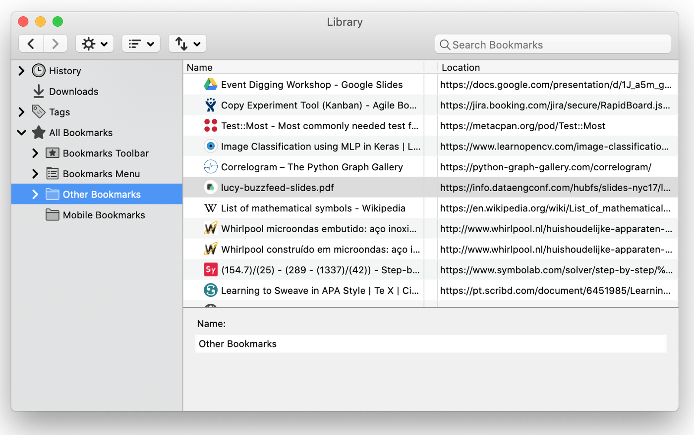
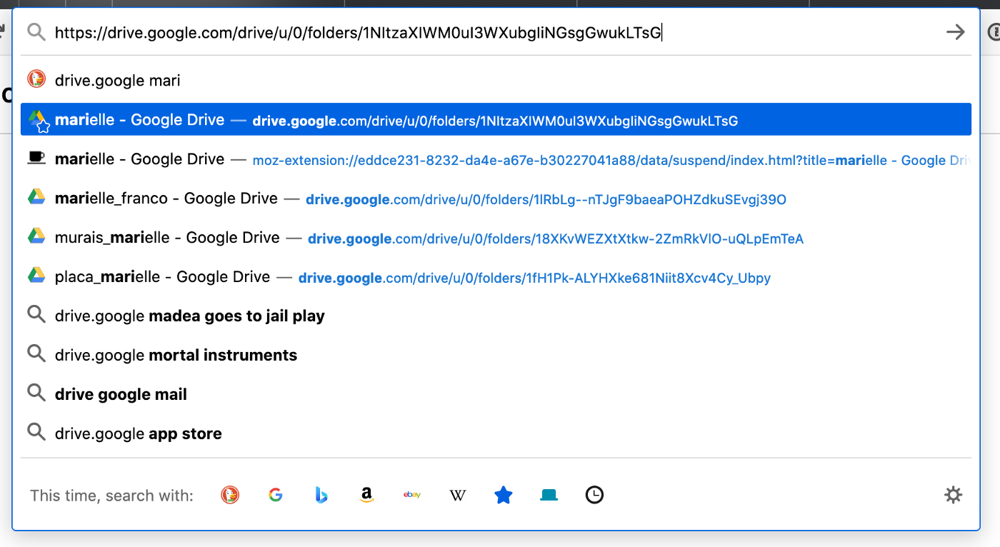
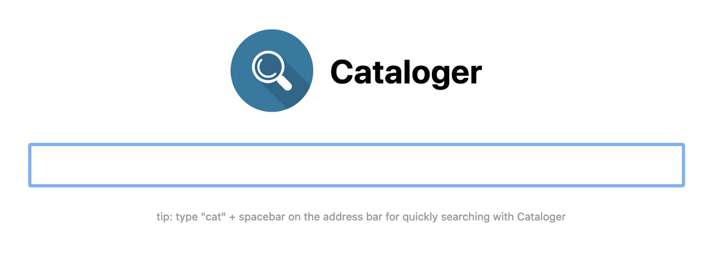
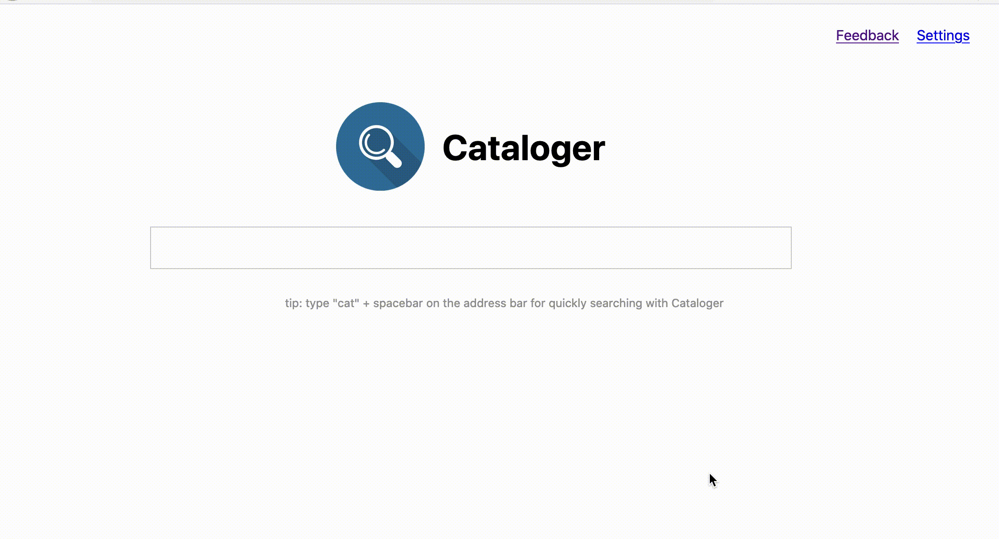

Do you remember bookmarks? Do you still use them? How do you organize your bookmarks? I organize it like this:

Yes, everything is under Other Bookmarks, or under Bookmarks Toolbar, whatever, I don't organize them, I have just too much for it to be worth organizing, and that's because of the way I use bookmarks.

According to the Merriam-Webster dictionary, a bookmark is:

> a menu entry or icon on a computer that is usually created by the user and that serves as a shortcut to a previously viewed location (such as an Internet site)

*Shortcuts*, when I think about shortcuts I remember the icons of programs in our desktop, if there is just a few then it's easy to find something you want, but if there are too much icons then it actually takes a long time until you find the right one, even if you organize them really well, opening folders inside folders inside folders is not all that practical.

Instead, I prefer to view bookmarks as *indexes*, to be used on a *search.* On my day-to-day I come across many links I'll need to access again later, specially at work, so I just want to index it to quickly access later by just remembering part of its url or title and typing on the address bar like this:

_a google drive folder I had to access often_

Because I do that a lot, right now I have 764 bookmarks already, and growing, so the address bar started getting limiting, sometimes not being good enough to find my bookmarked pages. This happens, for example, in all sorts of articles I find interesting and bookmark to use as reference later, but I don't recall the title or the link, just a vague idea of what it talks about, so I built Cataloger:

Cataloger is a Firefox and Chrome extension that scrapes the page content of all your bookmarks, allowing you to search it's whole content. All the fetching and searching is done completely local, so your privacy is guaranteed and search is blazing fast

Cool! Now I can find content that I care about, that I personally found interesting enough to index it for later, effectively creating my own small and personal Google of knowledge.

Cataloger is available on [Firefox Add-ons](https://addons.mozilla.org/en-US/firefox/addon/cataloger) and [Chrome Webstore](https://chrome.google.com/webstore/detail/cataloger/dkfaoaegfclpedkbhmpcbifpicpcedko?hl=en&authuser=0), can't wait to hear your feedback!

## Comments


If you'd like to add a comment, please [send a merge request adding your comment here](https://github.com/rogeriochaves/blog/edit/master/source/_posts/%%filename%%), copying this block as an example
