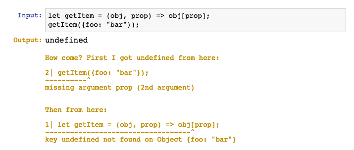
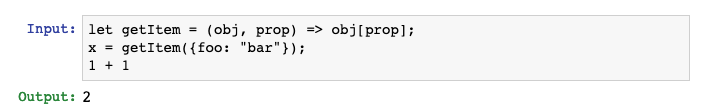
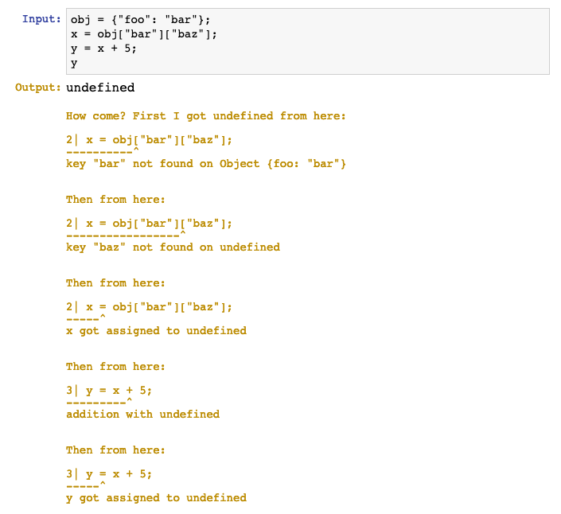
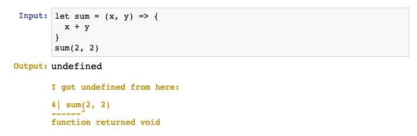
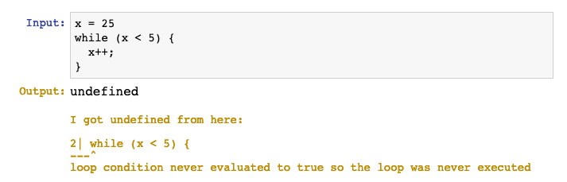
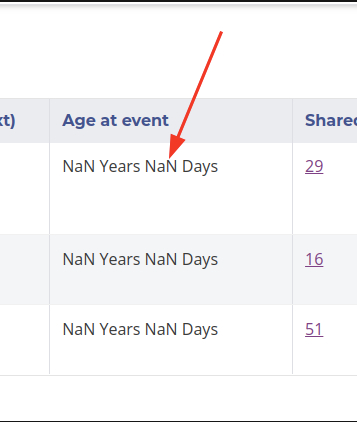

Nowadays there are projects like [Elm](https://elm-lang.org/) which gives you zero runtime exceptions by enforcing very strict types, also [TypeScript](https://www.typescriptlang.org/), [Flow](https://flow.org/) and [PureScript](https://www.purescript.org/) that push you in this direction.

But what if we went through the opposite way? Never break the code, not because we have a very strict language, but because we have a very loose one, that just accepts everything. If you watched the [Wat](https://www.destroyallsoftware.com/talks/wat) talk you probably know that JavaScript is pretty much like that already.

In JS you can do `[] --- {}` no problem, and it gives `NaN` which, if you think about it, is actually not wrong! Most other languages would complain when you do math operations with things that aren't numbers. But what if we took that to the next level? Have you ever wondered, what if you could do this and it actually worked?

```javascript
undefined = function () {}
```

The implications are amazing, you would always be able to call any non-existing property in any non-existing variable and it would just work!

```javascript
> undefined.foo.bar.baz()
undefined
```

Boom! No errors!

But this is not the only runtime exception that JavaScript has, is it? So to take a step further and make sure there would be no runtime exceptions, I wrote my own parser and interpreter of JavaScript using Elm: it required a non-runtime errors language to create another. Right now it only works with a small subset of JavaScript code, but good enough to have some fun, go ahead, [click here](https://rogeriochaves.github.io/unbreakablejs/) and try to write some code that will throw a runtime error, I challenge you!

[Go to unbreakable.js playground](https://rogeriochaves.github.io/unbreakablejs/)

(invalid syntax and [infinite loops](https://en.wikipedia.org/wiki/Halting_problem)) doesn't count, I don't know how to stop those)

Undefined Tracking
==================

The main issue with undefined is not undefined per se, it's tracking where did they came from, in case you were *not* expecting an undefined. The goal with unbrekable.js is get your code running no matter what, but if you want to investigate why something is going wrong, then that should be easy to do so.

For that, I thought of adding a nice litte thing which is to always track when undefineds compound with each other, for example:



On the other hand, if you never use this value, then you won't see this undefined tracking, because you wouldn't care about how a variable you don't use became undefined:



But if you need so, even in a more complicated case, you can track the whole path and see how code unravelled:



(right now there is no NaN, unbreakable also handles it as undefined)

Also tricky cases like this:



Or this:



Why would anybody want to do that?
==================================

Well, now that it's done, I need to find some rationale on why could it ever be beneficial, so here you go.

You are a dev, you don't want bugs in production, you don't want unexpected behaviour, so you do your utmost to find those issues, the earlier the better, type checking will catch some bugs, tests will catch some others, code reviews, linter, static security analysis, and when it all fails, runtime errors prevents unexpect behaviour to go further. The theory is that by having all those early checks, the small parts will be reliable, and you will have a solid foundation to move forward and focus on real user issues. But it that so?

The problem with Software Engineering is that it's a very complex craft, very social, with millions of variables that can affect the outcome, there is never a generally correct answer, it all depends. Adding a practice into software development team is more like an intervention in a natural or social system, you can hardly predict all elements it will interact with, we don't even know yet if [dynamic typing is better](https://games.greggman.com/game/dynamic-typing-static-typing/) [than static typing](https://blog.acolyer.org/2017/09/19/to-type-or-not-to-type-quantifying-detectable-bugs-in-javascript/), we have wasted endless hours in online discussions on all kinds of holy wars, yet we have very few randomized interventional studies with good controls, big sample size and aware of all the biases.

So, I propose a bit more rebelious theory: that in some scenarios actually all this time you spend fixing things the machine tell you to fix does not pay off, fixing the small problems may be distracting you from actual user pains and local optimizations diverging from global goals. In those scenarios, no small problem can actually cause a huge damage. Moreover, your foundation may be weak, but if you are in an environment where things are changing too fast, it may be actually beneficial if you don't spend too much time on foundation because you will have to turn it upside-down every once in a while.

In other words, I don't think this works for critical and low-level systems, where even a small flaw can be a major disaster, but it may work for high-level apps, startups, exploration projects or prototypes. Sure, maybe your users will see this:



But that's not their biggest problem, their biggest problem is that they don't understand the navigation of your design very well, so you need to restructure the whole app. Good thing you didn't spending time fixing this NaN because it's going away anyway!

On the other hand, if this `NaN` is the biggest problem right now, then it should be as easy as possible to debug and fix it, that's where ideas like the undefined tracking come into play.

------

Anyway, I might as well be completely wrong, and this idea may be worthless, but at least it was fun to play with, let me know what you think!

Here is the Github Repo in case you want to contribute: <https://github.com/rogeriochaves/unbreakablejs>

And here is a babel plugin version of it, so you can try today in your projects! It doesn't eliminate all the runtime errors, only the main ones: <https://github.com/rogeriochaves/babel-plugin-unbreakablejs>

Thanks for reading!

## Comments


If you'd like to add a comment, please [send a merge request adding your comment here](https://github.com/rogeriochaves/blog/edit/master/source/_posts/%%filename%%), copying this block as an example
