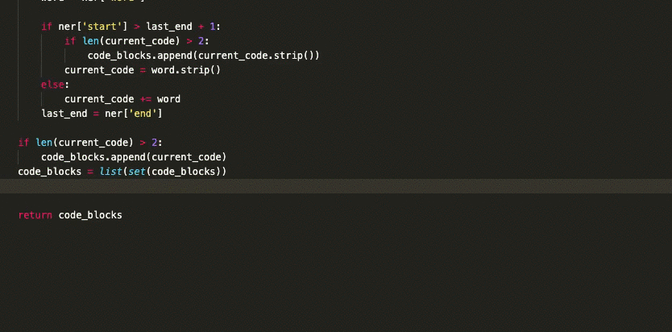

A long time ago I used to call myself a Ruby Developer, in an attempt to escape the boring languages I was being taught at college, like Java, C, VisualBasic and so on. But it didn't last too long, shortly the world was swallowed by JavaScript and then I never stopped moving languages again, learning more and more, and using all kinds of languages in different side-projects was actually a lot of fun!

Turns out nowadays I do Perl and Java for a living, who would guess! Still on side-projects I've been doing Python, Elm, Rust, Clojure, Elixir. I switch a lot, which helped me learn a great deal of all different paradigms and good practices. On the other hand, memory for syntax is not something I'm very good at, except for the language I'm working with for work.

For example, since I've been playing with ML I've being using a lot of Python, but I just can't memorize simple basic Python commands, I have to duckduckgo it all the time (and sometimes google it for better results, I admit). Maybe because of my Ruby roots, I created kind of a barrier against Python, it does not [fit my brain](https://www.linuxjournal.com/article/4731), but it is the best option for playing with ML

I realized I was doing this repetition kinda a lot:
1) I know what I want, just need to sort the list now!
2) Damn what's the command again for that?
3) Cmd + Tab, Cmd + T, Search DuckDuckGo
4) Quickly screen the page and... oh yeah, I remember, `sorted()`
5) Cmd + Tab back to IDE/jupyter

Most of the times I don't even need to click in the search result, I just find it with the bat of an eye, but it's still annoying when it happens too much, and sometimes disruptive for the coding flow

So then I thought "hey, I can automate that right?". This gave me the idea to create **Codesearch**: a VS Code and Alfred extension that will Google your query and scrape the results page finding code snippets automatically for you using a machine learning model

I hope it is useful for you too as it is for me, go to the github repo to instructions on how to install it:

[https://github.com/rogeriochaves/codesearch](https://github.com/rogeriochaves/codesearch)

Have a nice day!

P.S. because of my problem remembering languages and being too lazy to do repeated boilerplate all the time, I also created unit, a tool which setup a test file for you in many languages, so you can TDD away without the annoying setup part:

[https://github.com/rogeriochaves/unit](https://github.com/rogeriochaves/unit)