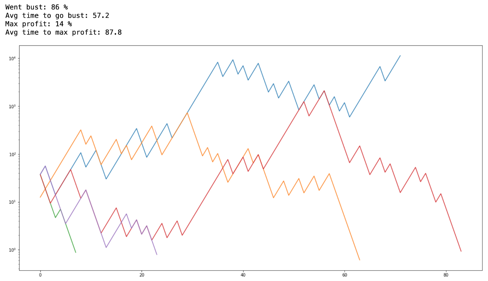

I give you $25, then I tell you that you can bet any amount of that and you have 60% chance of getting double of it, or 40% of losing the amount. You can repeat this process how many times you want.

Seems like a very good deal, right? It's 60% so you win most of the time, play it right and you will get rich! Still, on an experiment, [28% of participants went bust](https://en.m.wikipedia.org/wiki/Kelly_criterion#Example). Why is that so?

You go bust when you bet too much, to see that in practice I wrote [a notebook](https://github.com/rogeriochaves/notebooks/blob/master/probabilistic/Kelly%20Criterion.ipynb) with some simulations. For example, if participants where to bet constanly 50% of their money:

50% bet
-------



Most of them whet bust, 86%, not a great strategy. What if we play very safe? Always bet only 10% of your money:

10% bet
-------


Awesome, nobody went bust, that would be a very good strategy. Problem is, it also took them many rounds to reach the max profit (I capped at 10k), now, real world is finite, we don't live forever, imagine for example if this 420 average would mean years. Ain't nobody got time for that.

On the original experiment, participants were limited to 300 bets. So how can we maximize our profits, while minimizing the chance to go bust?

An old theory to improve our bets is to use the [Expected Utility Hypothesis](https://en.m.wikipedia.org/wiki/Expected_utility_hypothesis). The idea is that instead of a fixed strategy (like 10% or 50%) you should always bet on whatever maximizes your "utility", the "utility" definition may vary, but Bernoulli defined it in the 1700s as:

$$
utility = log(wealth)
$$

So, the richer you are, the smaller the utility of additional money.

With that we can decide how much we are going to bet on each round like this:

```python
for bet in range(0, cash + 1):
  utility = 0.6 * math.log(cash + bet) + 0.4 * math.log(cash - bet)
```

Then you select whatever bet has the biggest utility. This issues great results:

Expected Utility Hypothesis
---------------------------


Only 5% went bust now, and average time to max profit went down to 284, much better!

There is also an alternative to Expected Utility Hypothesis called [Prospect Theory](https://en.wikipedia.org/wiki/Prospect_theory), which tries to map better on how we humans actually take risks. On prospect theory the "utility" you give you an outcome heavily relies on weather it's positive or negative.

As risk-averse humans, people would not take a bet where you have 60% chance of winning $100, but 40% of losing $100. The pain of losing $100 could only be compensated if the offer was like 60% chance of winning $200 vs 40% of losing $100. Still, lots of people won't take this bet.

I've managed to simulate a prospect value function like this:


You can see that the curve on the upper side (positive outcomes) is at 4, while on the lower side (negative outcomes) is much steeper, at -8, showing the idea that our pain of losing money outweighs our happiness in getting some more.

So going back to the bet, how much of $25 would you bet for 60% chance of doubling it? It seems like nothing. If my calculations are correct according to prospect theory, at 60% the chance of winning never outweighs the loss so utility is always negative, it feels like you are always losing. But it does give the smallest negative utility always at the maximum amount, starting with $25 (-1.2 utility). Needless to say this is not a very good strategy:

Prospect Theory
---------------


I don't know if I did some misinterpretation of prospect theory or what, but maybe it explains why so many humans went bust on the original experiment. I also tried prospect theory considering everything as a profit starting with the $25, but then it behaves just like the Expected Utility Hypothesis because there is no asymmetry from losses nor very high or very low percentages that would change our perception.

Finally, the last method is actually the simplest one to calculate, [Kelly criterion](https://en.m.wikipedia.org/wiki/Kelly_criterion#Example) was described John Larry Kelly Jr. at Bell Labs in 1956. This is the formula:

$$
bet = cash * (chance * 2 - 1)
$$

Which for our case means you should always bet 20% of your money as this is a 60% chance bet. Very simple.

Kelly Criterion
---------------


That's it! I had fun playing with those simulations, hope it can be useful to you. [Here is the link to the notebook](https://github.com/rogeriochaves/notebooks/blob/master/probabilistic/Kelly%20Criterion.ipynb) if you also want to play with it yourself.

Cheers!

## Comments


If you'd like to add a comment, please [send a merge request adding your comment here](https://github.com/rogeriochaves/blog/edit/master/source/_posts/%%filename%%), copying this block as an example
