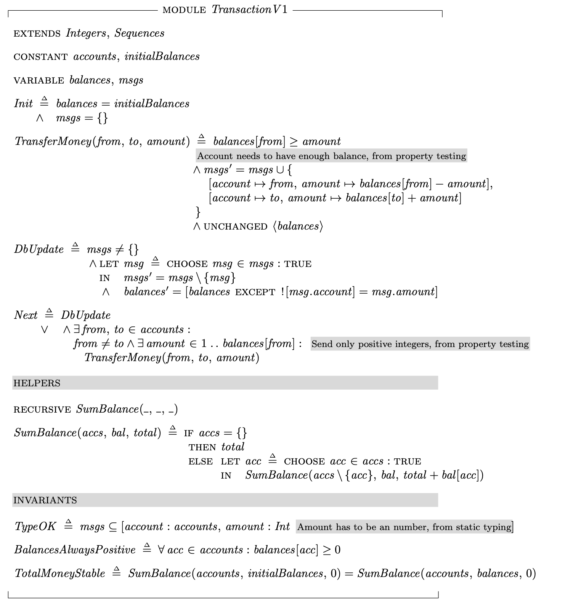
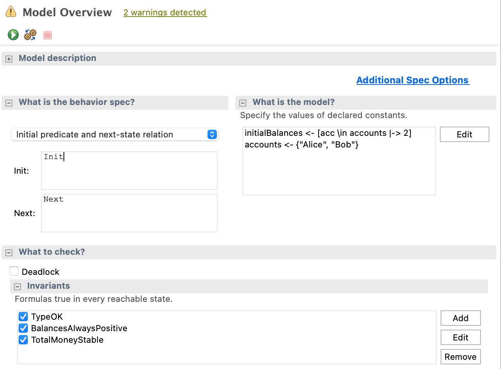
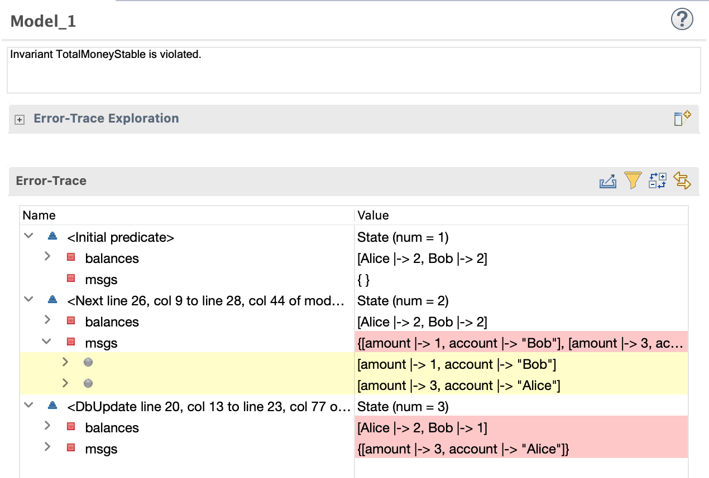
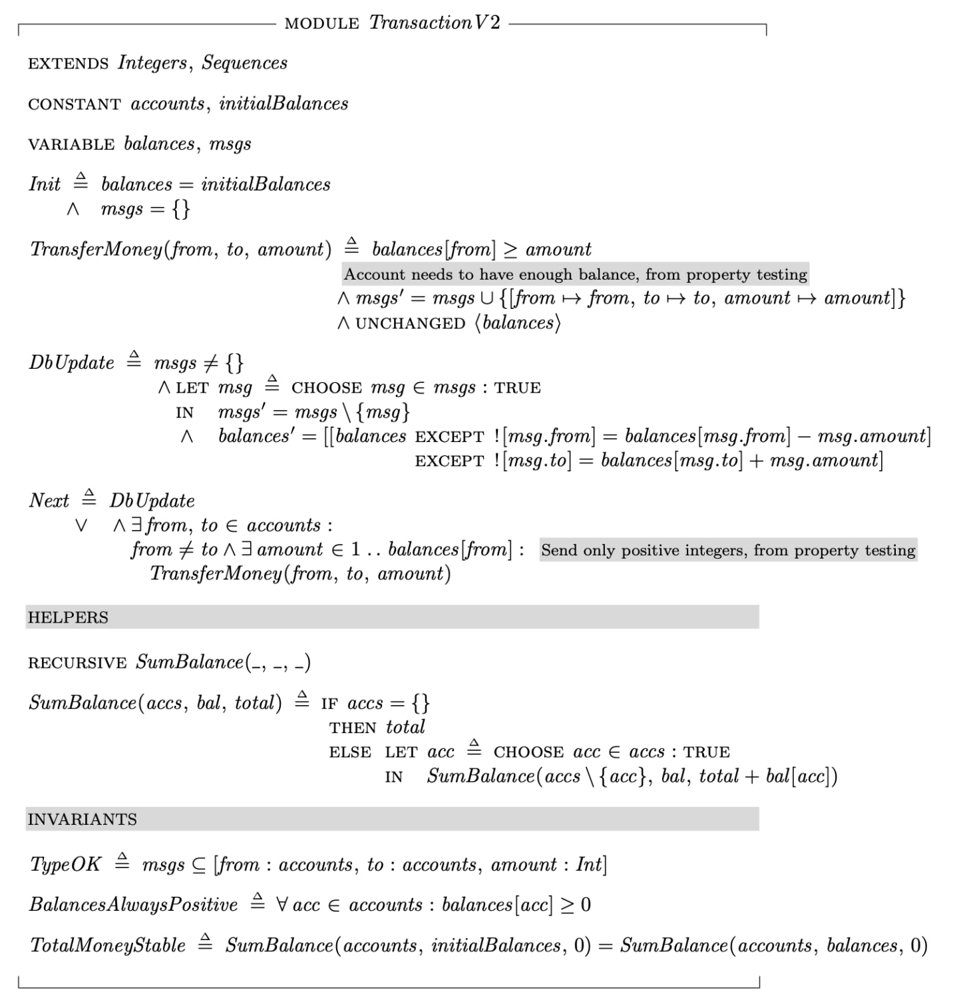
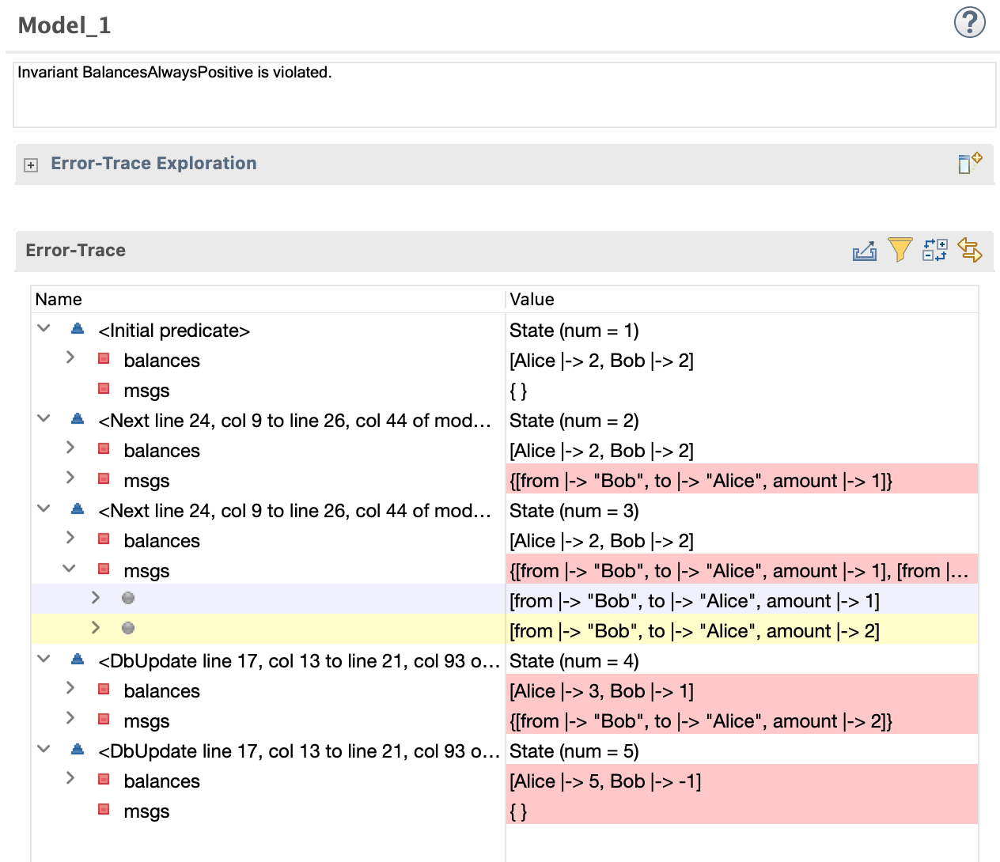
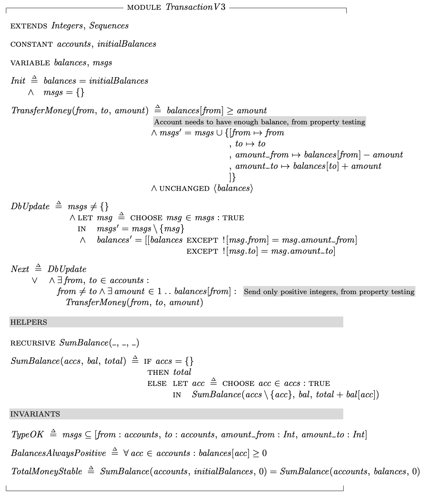
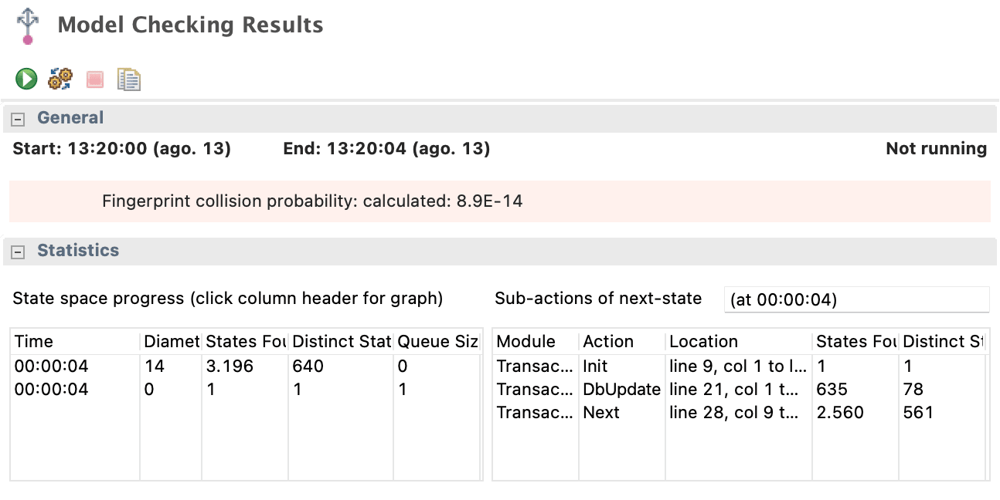

### From unit tests to formal specification

Software is famously known to have flaws, good practices and automated tests have helped us reduce issues, but most of the industry pretty much gave up on the idea of having software completely free of bugs, instead we moved our strategy to delivering early and iterating faster, letting the real world be our QA, and the real world is indeed the best QA there is. But is that really the only way? How come we always have gaps when testing our sofware? I mean it's computers, why can't we like simulate all the bits and be sure to check everything? What if we do unit tests? Integration tests? E2E tests? Contract tests? Have 100% coverage? Do some Mutation tests? If we apply all the tricks we can, can we feel safe with code which written by other humans? What if the code was not written by a human, but a machine, like [Copilot](https://copilot.github.com/)?

The idea for this blogpost came from [an insight by Nicholas Tietz](https://ntietz.com/tech-blog/future-of-software-engineering-is-formal-methods/), he suggests that maybe with AIs like Copilot evolving, it could be the case that we humans focus more on the specification and verification of what we want to be done, and the machine could automate the coding part.

If you think about it, it's kinda like doing TDD, in which on the first step you need to "write a test that passes [iff](https://en.wikipedia.org/wiki/Iff "Iff") the feature's specifications are met". Then, on the seconds step you see it fail, and on the third step you "write the simplest code that passes the new test". This is the step that could be automated by a machine.

Most important, and often overlooked by TDD beginners, it the keyword **simplest**. Write just enough to make the test green, nothing more, because this way you will be forced to write more tests for the functionality that you know is still missing, and then when you do, you are sure that functionality is tested as well. This is also a great way to think about what a machine will do, more often then not, given an objective, machines [WILL find the simplest solution](https://www.reddit.com/r/todayilearned/comments/at5e45/til_that_when_simple_ai_was_taught_to_play_tetris/), often surprising us humans.

This means our tests need to ensure complete behaviour in order to prevent AI (or other devs) from taking shortcuts. Can we do that? Write our tests so well that it will force our code to behave properly? Let's try, let's start our project:

```bash
npm init
```

Unit Tests
----------

Create a test file transaction.test.js with a sample test, just to check our tests are working:

```javascript
test("it works", () => {
  expect(1 + 1).toBe(2);
});
```

Run it, all is working:

```bash
npx jest

 PASS  ./transaction.test.js
```

Alright, so now what do we actually want to build? My idea is to build a simple function to transfer money from Alice to Bob. To do that I wrote a test that creates a sqlite db, a balance table, put 10 [pesos](https://en.wikipedia.org/wiki/Peso#Origin_and_history) on Alice balance and 5 pesos on Bob balance. Then I call the function transferMoney, which doesn't exist yet but I intend to write it.

This function should transfer 10 pesos from Alice to Bob, we verify that by checking that the balances are correct, here is the the test:

```javascript
const sqlite3 = require("better-sqlite3");
const transaction = require("./transaction");

describe("transferMoney", () => {
  let db;

  beforeEach(() => {
    db = sqlite3(':memory:');
    db.exec("CREATE TABLE balance (account TEXT, amount INT)");
    db.exec("INSERT INTO balance(account, amount) VALUES ('Alice', 10)");
    db.exec("INSERT INTO balance(account, amount) VALUES ('Bob', 5)");
  });

  it("transfers money from Alice to Bob", () => {
    transaction.transferMoney(db, { from: 'Alice', to: 'Bob', amount: 10 });
    const alice = db.prepare("SELECT amount FROM balance WHERE account = 'Alice'").get();
    expect(alice.amount).toBe(0);

    const bob = db.prepare("SELECT amount FROM balance WHERE account = 'Bob'").get();
    expect(bob.amount).toBe(15);
  });
});
```

We run the test again, with `npx jest`, and find several errors: first of all we don't have sqlite, please install it with `npm install better-sqlite3`; then it will say it cannot find module `./transaction`, create transaction.js file and export a transferMoney function from it; with setup out of the way, now we need to implement the most simple thing to make the test pass:

```javascript
function transferMoney(db) {
    db.prepare("UPDATE balance SET amount = 0 WHERE account = 'Alice'").run();
    db.prepare("UPDATE balance SET amount = 15 WHERE account = 'Bob'").run();
}

module.exports = { transferMoney };
```

```bash
 npx jest
 PASS  ./transaction.test.js
  ✓ transfers money from Alice to Bob (13 ms)
```

Our tests passes! We did TDD which guided our implementation, moreover, if you run Jest with the --coverage flag you can see we have 100% coverage, so our code must be perfect and free of bugs right? Right!? What? Hard-coded values you say?

Well, obviously, our code sucks, we didn't even had to use the parameters as our current test suite does not force us to. How can we force parameter usage? One solution is to write more tests with a slightly different value, to force the parameters to be used -- but that feels a bit stupid.

This why TDD has a last step: Refactoring, where you can reorganize the code, preserving the functionality without adding anything new, while the tests still passes. So let's rewrite the code like something closer to what we expected (you might not like the result either, but bare with me):

```javascript
function transferMoney(db, { from, to, amount }) {
    db.prepare("UPDATE balance SET amount = amount - ? WHERE account = ?").run(amount, from);
    db.prepare("UPDATE balance SET amount = amount + ? WHERE account = ?").run(amount, to);
}
```

Run the tests again, they pass.

You can argue that a machine would not refactor the code like we did, but to be honest, I don't think it would even need the refactor. Even though machines take shortcuts, on the current state of the AIs we have, it would most likely make use of those parameters from the start, as human developers usually do too. The reason for that it that AI is trained on gazillions of human code (for now), so it's more likely to replicate a longer, more common solution, than to come up with a simpler but creative one. So let's assume this is the case and move forward.

Cool, we have a feature to transfer money working, it seems that TDD helped us implementing the happy path, we can ship to production and see if any problems happen. Do you already know which ones? Take a look on the previous code and find at least two things you think might go wrong with it.

Let's start with an easy one, the famous [billion-dollar mistake](https://www.infoq.com/presentations/Null-References-The-Billion-Dollar-Mistake-Tony-Hoare/):

```javascript
it("does not transfer any money when amount is undefined", () => {
  transaction.transferMoney(db, { from: 'Alice', to: 'Bob', amount: undefined });

  const alice = db.prepare("SELECT amount FROM balance WHERE account = 'Alice'").get();
  expect(alice.amount).toBe(10);

  const bob = db.prepare("SELECT amount FROM balance WHERE account = 'Bob'").get();
  expect(bob.amount).toBe(15);
});
```

Run the tests, we get an error:

```bash
npx jest
 FAIL  ./transaction.test.js
  transferMoney
    ✓ transfers money from Alice to Bob (56 ms)
    ✕ sending undefined does not transfer any amount (9 ms)

  ● transferMoney › sending undefined does not transfer any amount

    expect(received).toBe(expected) // Object.is equality

    Expected: 10
    Received: null
```

How can we prevent that? Plus all other nulls, undefineds or invalid types that can reach our function?

Type Checking
-------------

We could just add an if condition and return or throw if the amount is null, or undefined, an object instead of a number, etc, and also check on every other argument, not forgetting to write a unit test for each case or... we can just add types. Types constrain the solution space, it could guide a computer to generate code only within the types we added. Once you go very strict about it, some even say that [if it compiles, it works](https://wiki.haskell.org/Why_Haskell_just_works).

On JavaScript world it's very easy to move from dynamic to static types with TypeScript, so let's rename our files to transaction.ts and transaction.test.ts, and type all the variables. This is the typed test file:

```typescript
import * as sqlite3 from "better-sqlite3";
import * as transaction from "./transaction";

describe("transferMoney", () => {
  let db : sqlite3.Database;

  beforeEach(() => {
    db = sqlite3(':memory:');
    db.exec("CREATE TABLE balance (account TEXT, amount INT)");
    db.exec("INSERT INTO balance(account, amount) VALUES ('Alice', 10)");
    db.exec("INSERT INTO balance(account, amount) VALUES ('Bob', 5)");
  });

  it("transfers money from Alice to Bob", () => {
    transaction.transferMoney(db, { from: 'Alice', to: 'Bob', amount: 10 });
    const alice = db.prepare("SELECT amount FROM balance WHERE account = 'Alice'").get();
    expect(alice.amount).toBe(0);

    const bob = db.prepare("SELECT amount FROM balance WHERE account = 'Bob'").get();
    expect(bob.amount).toBe(15);
  });

  it("sending undefined does not transfer any amount", () => {
    transaction.transferMoney(db, { from: 'Alice', to: 'Bob', amount: undefined });

    const alice = db.prepare("SELECT amount FROM balance WHERE account = 'Alice'").get();
    expect(alice.amount).toBe(10);

    const bob = db.prepare("SELECT amount FROM balance WHERE account = 'Bob'").get();
    expect(bob.amount).toBe(15);
  });
});
```

And the typed implementation:

```typescript
import { Database } from "better-sqlite3";

export function transferMoney(
    db: Database,
    { from, to, amount }: { from: string, to: string, amount: number }
) {
    db.prepare("UPDATE balance SET amount = amount - ? WHERE account = ?").run(amount, from);
    db.prepare("UPDATE balance SET amount = amount + ? WHERE account = ?").run(amount, to);
}
```

Assuming you have typescript installed (npm -g install typescript), you can now compile and run the tests:

```bash
tsc --strict *.ts && npx jest transaction.test.js
```

We get an error:

```bash
transaction.test.ts:24:63 - error TS2322: Type 'undefined' is not assignable to type 'number'.

24     transaction.transferMoney(db, { from: 'Alice', to: 'Bob', amount: undefined });
                                                                 ~~~~~~
```

Notice it's an error on the test file, but the test didn't fail, it didn't even run because sending undefined is not allowed. Now for our unwanted behaviour we cannot even write a test, it's actually forbidden, you are forced to delete that test, that's very cool!

We are so strict now, that certainly means we won't have issues with our code anymore right? No? We certainly closed more gaps now, and we can keep going, maybe write more and more unit tests covering things we can remember that can cause problems, maybe getting more creative about types, like introducing [monads](https://duckduckgo.com/?q=Monads+are+just+monoids+in+the+category+of+endofunctors&t=ffab&ia=web) to handle side-effects and see if it helps.

But even if we go through this effort, what bugs may still be lurking out there? Let's say we wrote as much unit tests as we could and typed everything, how do we know we are still not missing some edge case? Maybe try random stuff and see if something breaks? Yeah! That's a good idea!

Property-Based Testing
----------------------

In Property-Based Testing, you generate lots of samples to give to your function and write some assertions about it. Because of this sampling, Property-Based is also known as Fuzz Testing, but I like the name Property-Based Testing better, because it highlights the most important concept to grasp about this kind of test: that you should assert on *properties* that your output must hold*,* not on specific examples like unit tests, on *properties.* It requires a different mindset to think about properties, personally for me it was hard to do, since I was for many years writing just regular unit tests.

For example, if you are writing a simple sum function, to sum A and B. You cannot write a test to generate a thousand random numbers for A, and for B, and then just assert the result of sum(A, B) should be A + B. That's too easy! You are simply replicating the behaviour of your actual implementation, that doesn't help anyone, both your code and test could be wrong together. Instead you focus on properties, for example, no matter which of those 1000 random numbers are summed together, two positives should always return a positive result, if one of them is negative then is should have the sign of the greater of the two, or any other properties you can think about. If a counter-example is found, the test will tell you.

Let's write one:

```typescript
import fc from "fast-check";

// ...

it('ends up with more money on the receiving account', () => {
  fc.assert(fc.property(fc.integer(), amount => {
    db.prepare("UPDATE balance SET amount = 10").run();

    try {
      transaction.transferMoney(db, { from: 'Alice', to: 'Bob', amount });
    } catch (_) { return; }

    const alice = db.prepare("SELECT amount FROM balance WHERE account = 'Alice'").get();
    const bob = db.prepare("SELECT amount FROM balance WHERE account = 'Bob'").get();
    expect(bob.amount).toBeGreaterThan(alice.amount);
  }));
});
```

Basically what this test does is using [fast-check](https://www.npmjs.com/package/fast-check) to generate random integers (with fc.integer) which is then passed to our callback to make and assertion. And what can we assert it's always true when transferring money from Alice to Bob? What is a *property* of a transference? Here they both start with 10 pesos, so the property we check here is that no matter how much money is being transferred, Bob should always end up with more money than Alice. We also ignore any errors, as we are only interested in the successful transfers for now.

Let's run it!

```bash
tsc --strict *.ts && npx jest transaction.test.js
 FAIL  ./transaction.test.js
  transferMoney
    ✓ transfers money from Alice to Bob (6 ms)
    ✕ ends up with more money on the receiving account (21 ms)

  ● transferMoney › ends up with more money on the receiving account

    Property failed after 1 tests
    { seed: -1111144902, path: "0:0", endOnFailure: true }
    Counterexample: [0]
    Shrunk 1 time(s)
    Got error: Error: expect(received).toBeGreaterThan(expected)

    Expected: > 10
    Received:   10
```

It found one counterexample: 0. Yeah, Alice is trying to transfer zero pesos to Bob, now it starts coming down to specs of the system you are building, is this supposed to be allowed? Let's say no, because we think it's too stupid to do a zero transfer, and we do a simple fix for it on the top of our transferMoney function:

```typescript
if (amount == 0) throw "cannot transfer 0 pesos";
```

Great, the case for 0 is fixed, let's run again

```bash
tsc --strict *.ts && npx jest transaction.test.js
 FAIL  ./transaction.test.js
  transferMoney
    ✓ transfers money from Alice to Bob (5 ms)
    ✕ ends up with more money on the receiving account (53 ms)

  ● transferMoney › ends up with more money on the receiving account

    Property failed after 2 tests
    { seed: -1121527945, path: "1:1:0:0:0:0:0:0:0:0:0:0:0:0:0:0:0:0:0:0:0:0:0:0:0:0:0", endOnFailure: true }
    Counterexample: [-1]
    Shrunk 26 time(s)
    Got error: Error: expect(received).toBeGreaterThan(expected)

    Expected: > 11
    Received:   9
```

Uh oh, Alice sent -1, we haven't though about that! Like a QA the property-based testing tries to reduce the counterexample to the simplest one that fails, telling us that allowing people to transfer negative amount of money breaks our property. Transferring negative money is not something our business want, so we improve our check:

```typescript
if (amount <= 0) throw "only positive amounts are allowed to be transferred";
```

Run the tests again and you will see that they pass, great! What other properties can we ensure? Let's say our business is a good bank, the kind that do not want anyone to have [debt](https://www.google.com/search?q=%22You+have+to+avoid+debt+because+debt+makes+the+system+more+fragile%22&hl=nl&sxsrf=ALeKk01BPuDx2oQ1ozEv1BpyY55K6GDSzA%3A1628803481946&ei=mZEVYYamOdTygQaA5bm4BA&oq=%22You+have+to+avoid+debt+because+debt+makes+the+system+more+fragile%22&gs_lcp=Cgdnd3Mtd2l6EAM6BwgjELADECdKBAhBGAFQwAtY9A9gpRFoAXAAeACAAbcBiAGMA5IBAzEuMpgBAKABAcgBAcABAQ&sclient=gws-wiz&ved=0ahUKEwjG1szntazyAhVUecAKHYByDkcQ4dUDCA0&uact=5). One of the properties we could check then is that Alice always have a positive balance after every transfer:

```typescript
expect(alice.amount).toBeGreaterThanOrEqual(0);
```

```bash
Property failed after 2 tests
    { seed: -1313110683, path: "1:1:0:0:0:0:0:0:0:0:0:0:0:0:0:0:0:0:0:0:0:0:0:0:0:2", endOnFailure: true }
    Counterexample: [11]
    Shrunk 25 time(s)
    Got error: Error: expect(received).toBeGreaterThanOrEqual(expected)

    Expected: >= 0
    Received:    -1
```

The counterexample found is 11, this made Alice end up with -1 because it's more money than there is on the account balance. Solving that is a little more tricky, we need to first check how much balance there is left on the account, let's do it:

```typescript
const balance_from = db.prepare("SELECT amount FROM balance WHERE account = ?").get(from);

if (amount > balance_from.amount) throw "there is not enough money to be transferred";
```

Run the tests again, they pass, no counter-examples found! Awesome, our code is stronger than ever.

You can go on and do some more assertions, like if the account does not exist when somebody send something other than "Alice" and "Bob", but I want to focus on something else, which you probably noticed from the first example already, as this is the classic database 101 example. "Where is the transaction? For God's sake wrap this in a transaction already!" - you may say. But why do we need it? How can we prove that we need it? Here is our current code:

```typescript
export function transferMoney(
    db: Database,
    { from, to, amount }: { from: string, to: string, amount: number }
) {
    if (amount <= 0) throw "only positive amounts are allowed to be transferred";

    const balance_from = db.prepare("SELECT amount FROM balance WHERE account = ?").get(from);
    if (amount > balance_from.amount) throw "there is not enough money to be transferred";

    db.prepare("UPDATE balance SET amount = amount - ? WHERE account = ?").run(amount, from);
    db.prepare("UPDATE balance SET amount = amount + ? WHERE account = ?").run(amount, to);
}
```

So far our unit tests didn't require us to use a transaction, our types also didn't, neither did our property-based tests, no one found a counterexample for a transaction. We do know, however, from experience, that our code can fail at each of those lines of code, our server could die, leaving the database in an invalid state in the middle of the transfer, not to mention when there are multiple instances running this code in parallel and updating Alice and Bob balances at the same time. To solve it with unit tests we could mock each of those functions and see what happens if they fail, but if this was much larger, mocking every line of code and seeing what happens if they fail is very boring to say the least. Fortunately, there is a better way.

Formal Specification
--------------------

If property based testing got you thinking about properties, formal specification will get you thinking about properties AND state. As you may have heard, [state is the root of all evil](https://henrikeichenhardt.blogspot.com/2013/06/why-shared-mutable-state-is-root-of-all.html). That's why functional programming folks want to push it away with pure functions, to a place we can reason better about it. Having stateless functions makes your program much easier to reason about, but you do need state at some point, otherwise your code is completely useless ([like Haskell](https://www.youtube.com/watch?v=iSmkqocn0oQ)).

Our previous code have a bunch of hidden state, since if you really think about it, your database is really just a global mutable variable, if some function changing it fails in the middle, or two functions change it at the same time, you will get in an inconsistent state. Good luck debugging *that*.

Now, Formal Specification tricky part is that it requires us to model all state transitions we have, but then it gives you the power to verify all the states your code can reach, not just simulate random scenarios, but actually checking ALL possible paths. The idea is to leverage the power of mathematics to build a full specification, allowing you to check every intermediary step if you want to (helping to check for issues in case your program halts).

For that we are going to use TLA+, a formal specification language created by [Dr. Leslie Lamport](https://en.wikipedia.org/wiki/Leslie_Lamport), he created it because he found that formal specification helped him to prove the correctness of distributed systems, the most famous of them being the [Paxos Protocol](https://en.wikipedia.org/wiki/Paxos_(computer_science)). I will not go in details about TLA+ here (I'm a beginner myself), but if you want to learn more about it, I really recommend watching [Dr. Leslie's video-tutorials](http://lamport.azurewebsites.net/video/videos.html), they are really fun, a bit weird, but mostly fun.

Enough talk, I will just paste the initial version of the specification here and we can go over it:

```
--------------------------- MODULE TransactionV1 ---------------------------

EXTENDS Integers, Sequences

CONSTANT accounts, initialBalances

VARIABLE balances, msgs

Init == balances = initialBalances
     /\ msgs = {}

TransferMoney(from, to, amount) == balances[from] >= amount (* Account needs to have enough balance, from property testing *)
                                /\ msgs' = msgs \union { [ account |-> from, amount |-> balances[from] - amount ],
                                                         [ account |-> to, amount |-> balances[to] + amount ] }
                                /\ UNCHANGED <<balances>>

DbUpdate == msgs /= {}
            /\ LET msg == CHOOSE msg \in msgs : TRUE
               IN msgs' = msgs \ {msg}
               /\ balances' = [ balances EXCEPT ![msg.account] = msg.amount ]

Next == DbUpdate
     \/ /\ \E from, to \in accounts :
           from /= to /\ \E amount \in 1..balances[from] : (* Send only positive integers, from property testing *)
             TransferMoney(from, to, amount)

(***************************************************************************)
(*                                 HELPERS                                 *)
(***************************************************************************)

RECURSIVE SumBalance(_, _, _)

SumBalance(accs, bal, total) == IF accs = {}
                                THEN total
                                ELSE LET acc == CHOOSE acc \in accs : TRUE
                                     IN SumBalance(accs \ {acc}, bal, total + bal[acc])

(***************************************************************************)
(*                                INVARIANTS                               *)
(***************************************************************************)

TypeOK == msgs \subseteq [ account : accounts, amount : Int (* Amount has to be an number, from static typing *) ]

BalancesAlwaysPositive == \A acc \in accounts : balances[acc] >= 0

TotalMoneyStable == SumBalance(accounts, initialBalances, 0) = SumBalance(accounts, balances, 0)

=============================================================================
```

At first this code looks very alien, but we can render it for a better visualization with LaTeX. If you have some experience with math symbols, that can help:



Okay let me explain. We are basically trying to replicate our code behaviour and all state changes here. We start with two constants: accounts, those will be Alice and Bob; and initialBalance, as we will put some initial money for each. Then we have two variables: balances, changing as the accounts transfer money to each other; and msgs, which we will use to model the queries that are being sent to the database, more specifically here only the UPDATE statements, we skip SELECT and pretend we can read the balances directly to make the spec simpler.

Then we have four functions. On **Init**, we define our initial state, nothing special.

On **TransferMoney** we do basically a replication of our current JavaScript implementation. The way to think about it is a bit different though, it's not imperative as in "do this update to the database", it's actually declarative like "we allow a state transition from wathever messages are already on the db queue *union* two new messages for updating *to* and *from* balances, as long as the from account has enough money.

On **DbUpdate** we are simulating the database actually changing the state, basically it's saying that if the *msgs* queue is not empty, we can switch to a state where the *msg* queue has all items but this first one, and the balances have this new amount on the specified *msg.account*

Now the **Next** is the interesting part of TLA+, it specifies what state changes your system can go through at each time step, in our case it's **DbUpdate** OR **TransferMoney** for each of the accounts we have, for any amount of money they might have in the balance, as long as it's positive. This is basically to say, the database could be updating and all people could be transfering money, back and forth, all the time, at the same time. Pretty much what happens with a system at scale, distributed or under high load, and we want to see what can happen there, what paths it can go through.

Then we have a helper, it's just a simple function to sum balances that we will use next.

Finally, we have our **Invariants**! Those are the things we want to verify. Those specifications need to remain true *all the time*, no matter where we stop on the execution, no matter how many computers we add.

Those, unfortunatly, won't come automatically, they will come from thinking. What properties do you want your system to hold? This depends on your goal, on business requirements, on, well, specifications, we are just formalizing them. Like unit tests, they might have gaps, but being at a much higher-level, a single specification can cover way more ground. This is what [Nicholas Tietz](https://ntietz.com/tech-blog/future-of-software-engineering-is-formal-methods/) meant, we can let Copilot or future AIs generate the code, while we humans focus on the specifications. A language like TLA+ may allow us to define them at the highest level that is still non-ambiguous.

Our first invariant **TypeOK** is a simple one, it's akim to type checks, we are making sure that on the msgs sent to the database *account* has always to belong in the constant *accounts*, and that the *amount* must be an integer.

Next is **BalancesAlwaysPositive**, we are a no-debt bank remember, so we assert that any point in time no balance is allowed to go negative, we already checked that with the property-based test and fixed it by introducing and `if (amount > balance_from.amount)` but could we be missing something?

Finally we have **TotalMoneyStable**, this is a new rule. Since we don't have deposits or withdraws yet, money cannot just appear out of nowhere right? If Alice started with 10, and Bob started with 10, and there is no one else in the system, but then suddently we have 25 pesos, then where did this money came from? So we add this invariant to make sure that at any point in time the total amount is the same as the initial one, since we have a closed system.

From TLA+ Toolbox, we can run our specification, and see if we violate any invariants. This is the model configuration we use:



Nothing surprising here, just one small detail is that we put just 2 pesos in each account, since if we put much more than that, the state space to verify grows exponentially large. Even though definition is in math, we are unfortunately still limited by mundane computing power.

Alright so let's run the model! 🥁🥁🥁🥁🥁

Oh no, we have an error!



The invariant **TotalMoneyStable** is violated, how did it happen? We can actually follow the steps the model found. First we initialize with Alice and Bob having 2 pesos each. Next we add two *msgs*, that Bob should have 1 peso and Alice should have 3, this means Bob is doing a single peso transfer. Next **DbUpdate** kicks in to update the balances and... ops, Alice has 2 pesos and Bob 1. One peso completely vanished of the system. Well, we know there is still a message left to be processed, but what if your system died at that point? Those invariants guarantee to be *always* consistent, no *eventually*consistent, *always* consistent.

The problem happens because our updates happen sequentially. What can we do to solve that? We can do both updates at once, this should solve our problems. Let's update our spec:



Okay now instead of sending 2 *msgs* to update the database, we are sending a single one, with *from*, *to*, and *amount*. Let's see what happens:



Oh no! Invariant **BalanceAlwaysPositive** was violated. How did that happen? Let's follow the steps. Initial balances, okay, then Bob did a transfer to Alice for 1 peso, but then *before* the database had time to process the update, Bob did yet another transfer to Alice, for 2 pesos this time, most likely it was another instance of our service running in parallel. As a result, once **DbUpdate** processes both *msgs*, Bob ends up with a negative amount, and that's terrible for our bank because we would have to charge interest and make money! No bank wants that I'm sure.

Alright, I have an idea for one final change:



Now additionally to updating both balances at once, we no longer send the amount to be transferred, but actually the final resulting amount for both balances. This way we are carrying the state inside the message, which means that even conflicting messages when processed will leave the state stable way, although it also means last-write-wins.

Let's run our model again:



Wow no errors! TLA+ could not find any issues on the 3.196 possible states it found. We solved folks, that's it, and we could do it without using transaction or locks! Great!

If you feel like it you can keep going, what would happen if we add another account? Say Alice, Bob and Carlo? Can you simulate the state changes that happen during a database transaction? Does it solve our problems?

Conclusion
----------

Making a sure a function free of bugs is very hard, and the definition what "free of bugs" mean actually depends on your specification. On our every day jobs most of the issues are avoided by plain human experience and judgment, if you could not see the code, guaranteeing it is working is super difficult. Tools like property-testing and TLA+ allow us to get closer and closer, and while I have no idea if those tools will indeed help us bridge the connection with AI, I know they are fun to learn.

Thanks for reaching the end of this blogpost, let me know how you like it. I need to end up with a warning, though: we only tested the algorithm here, there is a lot more to software than that, this is just a tiny part.

Now I kindly ask you to not leave yet and save the links listed below to read or watch later, they are more interesting than this one, and modeled my thinking about testing.

More Content
------------

[They Write the Right Stuff](https://www.fastcompany.com/28121/they-write-right-stuff) - an article from 1996, on how space engineers get their softwared to be free of bugs

[We need to talk about testing](https://dannorth.net/2021/07/26/we-need-to-talk-about-testing/) - on how our automated testing is still not even close to what advanced human testers can do

[Making Impossible States Impossible](https://www.youtube.com/watch?v=IcgmSRJHu_8) - making the best use of your static types

[Formal verification applied](https://www.youtube.com/watch?v=l9XZYI3jta0) - intro to TLA+ for devs