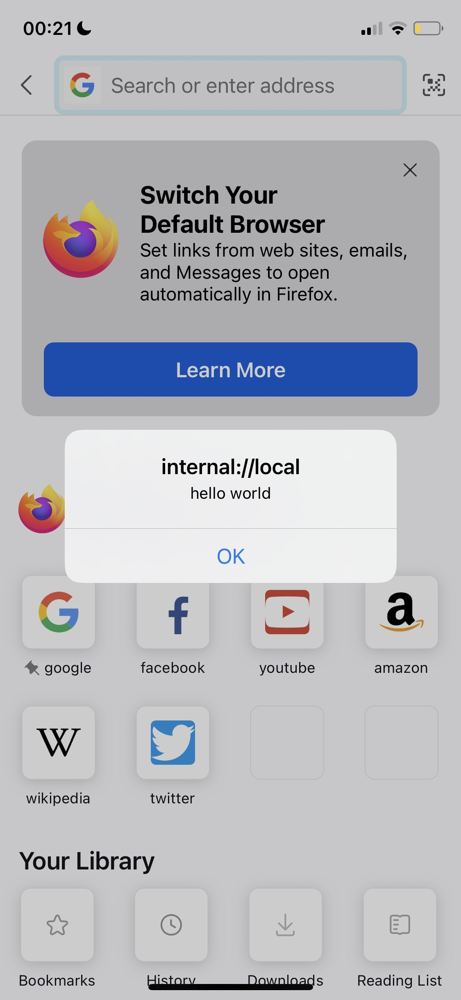
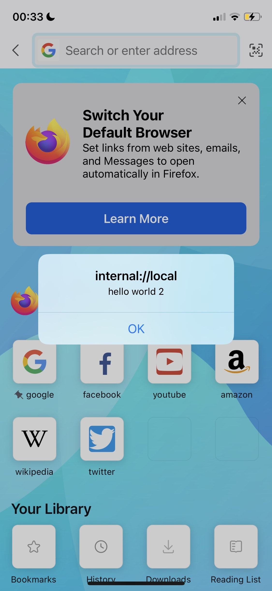
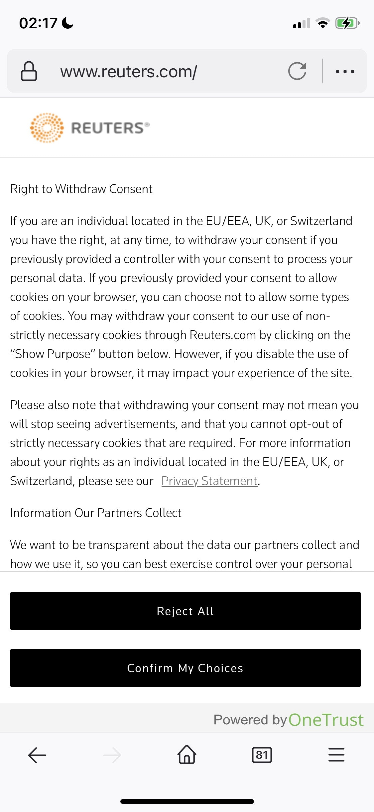
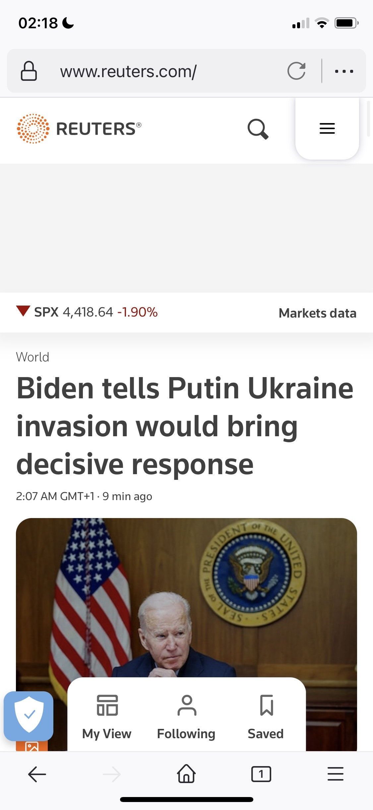

One thing that has been bothering me since forever in mobile web is how much clutter there is, from everything, but specially cookies. In europe, all websites require you to accept cookies, ALL of them, which makes you add an extra click forever, for your whole life. That's too many extra clicks for me!



Don't get me wrong, I admire the spirit of the law, that people should know how they are being tracked, but I don't know why decades later after this law came into play, nobody at Mozilla or Chrome teams thought of pushing that as a web standard, it just seems so obvious to me: if it's something every website has to build it over and over again, let's make it a standard. This way the browser itself could handle it, and so much better, I'm thinking like how iOS manages what each app can or can't do, the browser could do the same for the websites, at the very least we could have a standardized pop-up so I wouldn't need to search a different button each time!

At the computer, this is a solved problem for me, I've installed the extension [i-dont-care-about-cookies.eu](i-dont-care-about-cookies.eu), great extension, works wonderfully. But on iOS, I can't install it, because Apple wanted to control the ecosystem, it kept the browser powerless for a good amount of time, recently it added possibility to install add-ons to Safari, but only in a specific way with apps, and only in Safari because Apple always launch stuff for its own products first to get a head-start, classic Apple.

Anyway, there is actually a very good open-source add-on for Safari iOS that blocks cookies requests, called [Hush](https://github.com/oblador/hush), it's not as great as i-dont-care-about-cookies but good enough that my annoyance while using mobile web is gone! Unfortunately I cannot use it on Firefox for iOS, but I think I hate cookie requests more than I hate Safari or love Firefox, so very sadly I switched browsers for the time being.

But I have a plan, which I'm going to put in practice today: I will clone Firefox iOS from GitHub, patch i-dont-care-about-cookies together with it and build to my iPhone, so I can happily go back to my favorite browser. Let's do it!

To my surprise, instructions on firefox-ios GitHub page are super straight-forward, you only need python, nodejs and Xcode (of course) but that's it! I really like how they kept such a huge project as this with such small dependency requirements, while much smaller projects require you to spend a whole afternoon installing stuff to make it work. Kudos to the firefox team!

Also, to my second surprise, the very next section after installation on the README is "Building User Scripts", and where to put them, exactly what I need, they just made my life so easy!

So I created a file at `Client/Frontend/UserContent/UserScripts/MainFrame/AtDocumentEnd/Example.js`

```javascript
alert("hello world");
```

Classic! What better way to test something is working than our good old friendly alert amirite

So I kept following the installing instructions, opened it on Xcode, found somewhere where I can change to the "Fennec scheme" under the Product menu, and tried to build it, this got me some certificate errors which I were expecting already. Fortunately I already have a team and certificate set up for my other side project apps, so I can just use mine right?

---

Okay, I spent more time trying to fix certificates issues than I thought, fortunately at the end I found an easy solution: instead of trying to fix them manually, I opened the project on SublimeText (faster to open than VSCode) and did a search and replace all over for 43AQ936H96 (their team code) to my own team code, also I replaced all "org.mozilla.ios" with "app.rchaves.ios", this finally allowed the app to compile!

It worked!!



Woow was it really that easy? Certificates thingie but that's it? Cool!! It seems like I can 🥁🥁🥁 iterate!

If I just update the javascript to "hello world 2" and run the app again, does it work?

… iteration is slow, building and installing the app again takes time, even though I just changed one tiny javascript, I guess you can't escape that with mobile apps. But the answer is no, it does not work, I need to run webpack by hand. Okay, no problem, let's try again, build webpack aaaand, interesting! On the third time it didn't recompile anything and installation was much faster! Cool, now it works:



Okay, so next step is to inject the javascript from i-dont-care-about-cookies here on the same place where I have my hello world. To do that I downloaded the extension .xpi package, unziped it, and I plan to copy those javascripts inside, mostly as is.

…not as easy as I thought, i-dont-care-about-cookies code actually relies a lot on chrome.tabs and other APIs only available to extensions, those don't work inside UserScripts, so I will have to remove all this and extract just the core of it, which hides the cookies boxes.

So here is what I understand to be the main trigger of the original code:

```javascript
function doTheMagic(tabId, frameId, anotherTry)
{
	if (!tab_list[tabId] || tab_list[tabId].url.indexOf('http') != 0)
		return;

	if (tab_list[tabId].whitelisted)
		return;

	// Common CSS rules
	chrome.tabs.insertCSS(tabId, {file: "data/css/common.css", frameId: frameId || 0, runAt: xml_tabs[tabId] ? 'document_idle' : 'document_start'}, function() {

		// A failure? Retry.

		if (chrome.runtime.lastError) {
			let currentTry = (anotherTry || 1);

			if (currentTry == 5)
				return;

			setTimeout(function() {
				doTheMagic(tabId, frameId || 0, currentTry + 1)
			}, 300);

			return;
		}


		// Common social embeds
		chrome.tabs.executeScript(tabId, {file:'data/js/embeds.js', frameId: frameId || 0, runAt: xml_tabs[tabId] ? 'document_idle' : 'document_end'}, function() {});

		if (activateDomain(tab_list[tabId].hostname, tabId, frameId || 0))
			return;

		for (var level in tab_list[tabId].host_levels)
			if (activateDomain(tab_list[tabId].host_levels[level], tabId, frameId || 0))
				return true;

		// Common JS rules when custom rules don't exist
		chrome.tabs.executeScript(tabId, {file:'data/js/common.js', frameId: frameId || 0, runAt: xml_tabs[tabId] ? 'document_idle' : 'document_end'}, function() {});
	});
}
```

I basically reduced it to this:

```javascript
function doTheMagic() {
    if (document.location.protocol.indexOf('http') != 0)
        return;

    document.head.appendChild(document.createElement("style")).innerHTML = css;

    embeds();
    common();
}
```

After some fiddling around, some alerts here and there, I've got it successfully working! For example, here is Reuters website on regular firefox



All cookies, no content :(

And here is with my enhanced, i-dont-care-about-cookies version of firefox:



Wow I can almost even see the whole front news picture! No extra clicks

---

I've now been playing for a while with this firefox, and it seems to work perfectly, a full-fledged firefox! The only thing that is not working is allowing to set it as my default browser, duckduckgoing more for it, it seems that I need to beg for Apple to allow me to do that 🙄. So I sent them an email, let's see what they reply, meanwhile, I think I can already enjoy my firefox without cookies 🤗

I've made a fork from firefox-ios and pushed the code, if you have Xcode, go get it and build your own copy 😃

[https://github.com/rogeriochaves/firefox-ios-i-dont-care-about-cookies](https://github.com/rogeriochaves/firefox-ios-i-dont-care-about-cookies)

ps.: I've contacted Daniel, the creator of i-dont-care-about-cookies, and he didn't mind that I published this firefox-ios embeded version with his extension, just asked me to keep it up to date 😊


## Comments


If you'd like to add a comment, please [send a merge request adding your comment here](https://github.com/rogeriochaves/blog/edit/master/source/_posts/%%filename%%), copying this block as an example
