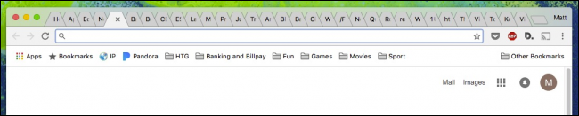
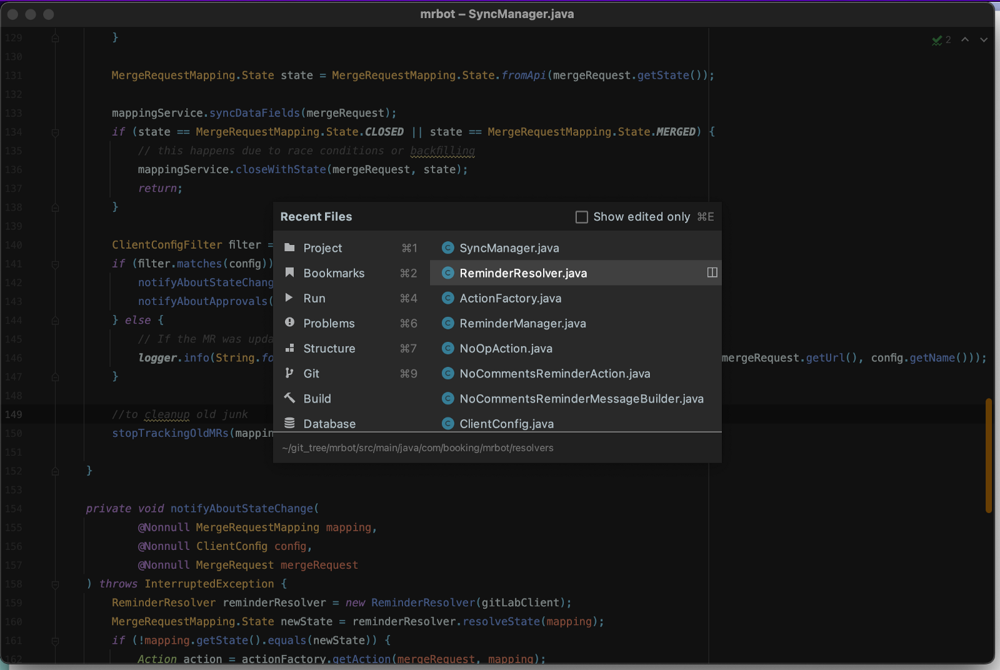
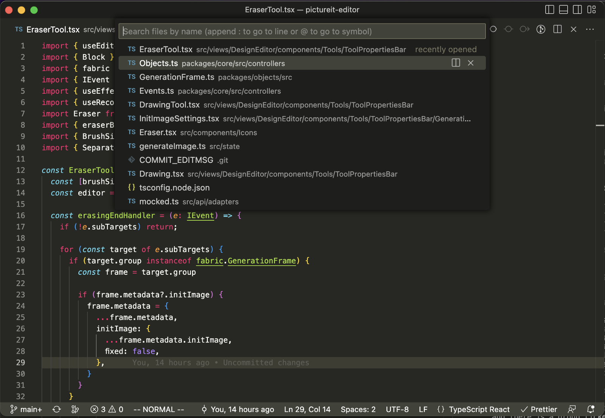
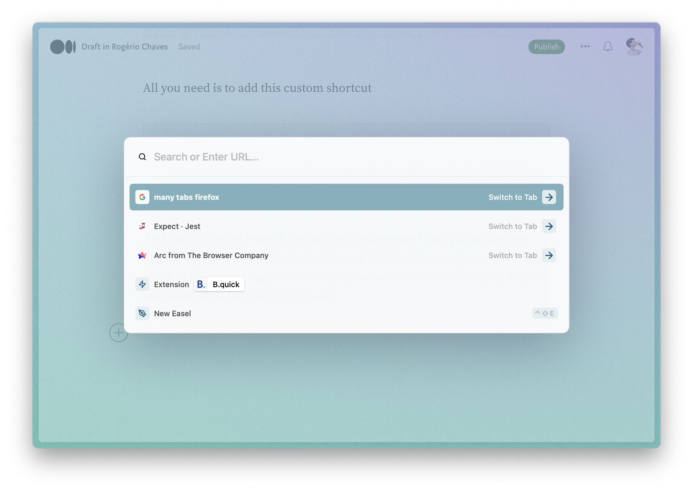

Tabs were a wonderful UI invention, ever since Chrome popularized them, they started showing up everywhere, on code editors, on Finder, it's just much better than having many windows open.
But then this happens with most people:



It is so easy to open a new tab, but so hard to close, people get very attached to their tabs, "I might need it later", "I will read it eventually". Then hundreds of extensions and practices that require discipline to manage the insurmountable amount of tabs pop up, but only the most dedicated can follow.

The thing is, our web got richer and richer over time, there are more things to do at the same time than ever before, tabs were great, but we need a better solution now.

I propose then a radically different approach: forget about tabs, get rid of them.

I noticed that when I was navigating between files in the code editor, or between open tabs in the browser, I spent a long time looking for the tab I wanted, over and over again, so much that often it was faster to just open another tab for the same link, increasing the problem.

Often also, I noticed the tab I wanted to navigate was one of the ones I had opened most recently, I just wanted to go back to it, or to that one before it.

So, if typing is faster than finding the tab, then all you need is a quick search, and if most of the times you need recent tabs, then they should be easily at the top of this search.

If you use IntelliJ, this is exactly what `Cmd + E` does, or the Recent Files feature. If you just press `Cmd + E` then `Enter`, it will take you to the previous open file, very convenient. If otherwise you start typing, you can quickly find and go where you intended, your eyes can find it super fast, much faster than it can find the right tabs!

IntelliJ was the first place I started living without tabs. I noticed I had to change the settings to completely hide them, because if I didn't, then I end up with the old habit of looking for the right tab, and getting annoyed that I couldn't find it. Since now I navigate through shorcuts, I actually end up hiding everything away, and I have full screen real estate to focus now.

This is how my IntelliJ looks like when I'm "switching tabs":



Look at the editor behind, no toolbars, no file explorer, and most importantly, no tabs.

Then, most recently, I went to more frontend work, and moved to VSCode, took me a while, but I could replicate the same environment there



All you need is to add this custom shortcut

```json
{
	"key": "cmd+e",
	"command": "workbench.action.quickOpenPreviousEditor"
}
```

And that was good enough for me.

On the browser land, I was still relying on discipline, tab snooze, etc etc, on Firefox, but then, a wild browser appeared, Arc! To my delight, Arc supported precisely my no-tabs workflow lifestyle. Look at me, writing this blogpost right now:



On Arc, when you press `Cmd + T` you also get this "Recent Files" navigation, by having that, Arc makes it so easy to hide everything else, and the website can use all your screen real estate.

It's not that tabs don't exist, they are there, just not in front of you. It makes it easier for you to really focus on one thing at a time, without worrying about managing your tabs and being all tidy and clean all the time.

Incidentally in Arc, this is also the shortcut to open a new tab, as every browser, so it really directs you into getting more used to this navigation style. As a nice addition, Arc also has this "Little Arc" feature, which opens a new small window in-place where you clicked the link, for example on Slack, allowing you to quickly skim over the link and dismiss immediately, or decide to actually open as a tab in the main browser. I felt this was super convenient for less focus switching, and less tabs.

That's it, if you have never lived without tabs before, I really recommend trying it, it's so relaxing.

Cheers!

## Comments


If you'd like to add a comment, please [send a merge request adding your comment here](https://github.com/rogeriochaves/blog/edit/master/source/_posts/%%filename%%), copying this block as an example
