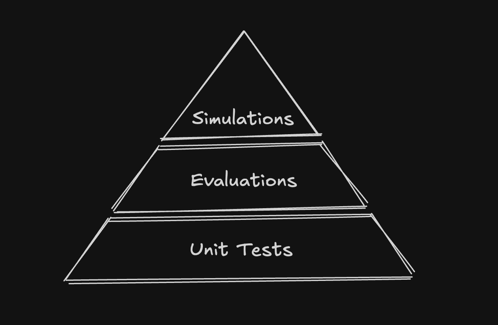

Ever since we have given tools in the hands of LLMs, we have been facing a persistent challenge: how do we systematically ensure that our agents really work? How do evals fit the picture? How do we know it’s reliable enough?

As we've built more and more complex agents, a pattern has emerged in our testing approaches. We’ve been testing it out with clients, and the concept seems to be getting more and more solid.

What we've uncovered is what we now call the **Agent Testing Pyramid** – inspired by the traditional Testing Pyramid, this is a three-layered approach that reflects the different types of quality assurance needed for reliable AI agents.

## **Unit Tests (Foundation)**

The base of the pyramid consists of traditional software tests, both unit and integration tests. While AI Agents are probabilistic in nature, they still rely on deterministic software components that must work flawlessly:

- API connections to external tools
- Data transformation pipelines
- Memory storage and retrieval
- Authentication mechanisms
- Rate limiting and error handling

If these components fail, it doesn't matter how sophisticated your prompts or retrieval systems are; if your pipeline is broken, your agent will fail, sometimes in ways that are not very obvious. The fast feedback of unit tests can save you a ton of debugging time, and they provide the foundation of reliability.

## **Evals & Optimization (Middle Layer)**

The middle layer encompasses all techniques for measuring and optimizing individual probabilistic components of your agent:

- RAG retrieval accuracy evaluations
- LLM response quality metrics
- Prompt optimization with frameworks like DSPy
- Fine-tuning with RLHF/GPTO for human preference alignment

This layer has a "data science" feeling to it - you're working with large datasets, optimizing towards better accuracy or a certain quality metric.

Each component (unstructured data parsing, retrieval, creative generation, etc.) needs to be evaluated and optimized separately, but contributes to the overall system performance. A 5% improvement in retrieval accuracy combined with better prompt engineering can compound into significantly better agent behavior.

This middle layer requires a healthy dose of ML methodology – training/validation splits, careful definition of metrics, and iterative improvement cycles. Without this discipline, teams end up chasing their tails with random prompt tweaks that sometimes help, sometimes hurt.

## **Simulations (Peak)**

At the top of the pyramid sit agent simulations - fewer in number but crucial for end-to-end validation. Using a library like [Scenario](https://github.com/langwatch/scenario), simulations test what really matters at the end of the day: can the agent actually solve real problems?

While the lower layers optimize individual components, simulations verify that they work together as an integrated system. They allow for:

- Multi-turn conversation testing
- Edge case validation
- Simulating multiple conversation paths
- Clear binary outcomes (can the agent do X? yes/no)
- Business value validation

Unlike single-turn evals, simulations can capture complex interaction patterns. Creating a dataset for optimizing multi-turn behavior would be prohibitively expensive; you'd need not just thousands of conversations, but thousands of variations of each conversation path.

Instead, carefully crafted simulation scenarios let you validate the most important cases with high confidence. While they may still not cover every possible interaction ever, they can simulate a wide range and provide clear evidence that the agent can handle key business requirements.

## **The Power of Binary Outcomes in Simulations**

While working with our customers, perhaps the most valuable aspect of simulation testing we found was the shift from talking only about probabilistic metrics to talking about binary outcomes. Instead of asking "How accurate is the RAG system on average?" they can ask:

"Can the agent successfully help a customer cancel their order when they don't remember their order number?"

The simulations layer:

- Maps directly to business value
- Builds trust through a clear demonstration of capabilities
- Identifies specific gaps that need addressing
- Communicates progress in terms that non-technical stakeholders understand

## **Finding the Right Balance**

The pyramid isn't rigid – we've seen the proportions shift based on project needs. Early-stage agents might go directly to simulations, skipping some unit tests. Mature systems might invest heavily in the middle layer to squeeze out additional performance.

But the overall structure has proven remarkably consistent. All three layers play essential roles in building agents that actually work in the real world and out in the wild.

## **Looking Forward**

As agent capabilities continue to advance, we expect the testing pyramid to evolve as well. New evaluation techniques will emerge, and simulation frameworks will become more sophisticated.

But the fundamental insight – that we need to test both the components and their integration across multiple conversation turns – is likely to remain true regardless of how the technology changes.

I've created [Scenario](https://github.com/scenarioai/scenario) exactly for this purpose, a powerful framework to get started with simulation-based testing, check it out.
